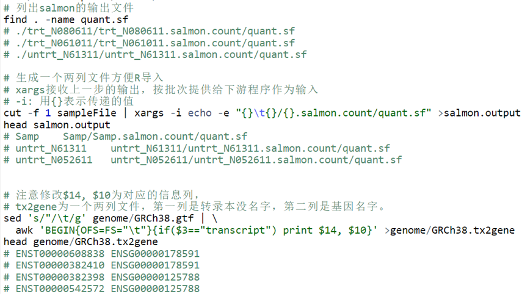

```{r, echo=F}
knitr::opts_chunk$set( echo = TRUE, message=FALSE, warning=FALSE, fig.width=8 )
```

## 检查有无缺失的包并安装，加载所有包


```{r}
site = "https://mirrors.tuna.tsinghua.edu.cn/CRAN"

options(BioC_mirror="https://mirrors.tuna.tsinghua.edu.cn/bioconductor")


if (!requireNamespace("BiocManager", quietly = TRUE))
  install.packages("BiocManager", repos = site)

a = rownames(installed.packages())

install_bioc <- c("DESeq2", "RColorBrewer", "gplots", "ggplot2", 
                  "reshape2", "stringr", "amap","BiocParallel",
                  "devtools","dplyr","tximport","ggrepel", "grid", "ggfortify")

for (i in install_bioc) {
  if (!i %in% a)
    BiocManager::install(i, update = F, site_repository=site)
    a = rownames(installed.packages())
}

if (!"ImageGP" %in% a){
  # devtools::install_github("Tong-Chen/ImageGP")
  devtools::install_git("https://gitee.com/ct5869/ImageGP.git")
}
suppressMessages(library("ggplot2"))
suppressMessages(library(DESeq2))
suppressMessages(library("RColorBrewer"))
suppressMessages(library("gplots"))
suppressMessages(library("amap"))

suppressMessages(library("BiocParallel"))
suppressMessages(library("ImageGP"))
suppressMessages(library("dplyr"))
suppressMessages(library(grid))
suppressMessages(library(ggfortify))
```


### 初始化，定义输入、输出和参数

此处为设置输入、输出文件和参数的地方，需要重点理解，以便后续修改。

* ⚠️ 注意文件路径问题。访问文件时若未指定则为当前路径。如`13_salmon_deseq2/metadata.txt`为当前路径下的`13_salmon_deseq2`目录下的`metadata.txt`文件。

```{r, echo=F}

```

使用时只需要修改 `salmon.output`和`metadata.txt` 即可。分组信息列必须是`conditionds`，如果不是，下面代码中的`conditions`也需相应的修改。这两个文件的获得见`12-转录组分析流程Salmon.pdf`的`整理Salmon结果`部分。

`salmon.output`文件包含的时salmon运行输出文件的路径，记住是**路径**，不是内容。所以需要确认`salmon.output`中指定的文件如`13_salmon_deseq2/untrt_N61311/untrt_N61311.salmon.count/quant.sf`是否存在，目录是否正确。


```
Samp	Samp/Samp.salmon.count/quant.sf
untrt_N61311	13_salmon_deseq2/untrt_N61311/untrt_N61311.salmon.count/quant.sf
untrt_N052611	13_salmon_deseq2/untrt_N052611/untrt_N052611.salmon.count/quant.sf
untrt_N080611	13_salmon_deseq2/untrt_N080611/untrt_N080611.salmon.count/quant.sf
```


```{r}
# Prefix for all output file 

output_dir = "result/salmon_deseq2/"

if (!file.exists(output_dir)){
  dir.create(output_dir, recursive = T)
}

output_prefix = paste0(output_dir,"ehbio.simplier")

# pipelineSalmon.sh生成的一个两列文件，第一列是样品名字，第二列是salmon定量结果的位置，注意第二列文件的路径
file = "13_salmon_deseq2/salmon.output"
# 分组信息表
metadata = "13_salmon_deseq2/metadata.txt"
# 分组信息所在列名字
design="conditions"
#设置组与组之间的比较
# comparePairFile = NULL
comparePairFile = "13_salmon_deseq2/compare_pair.txt"

# 转录本和基因的对应关系
tx2gene="13_salmon_deseq2/genome/GRCh38.tx2gene"
# 输入数据类型，salmon结果或reads count 矩阵
type="salmon"
# 差异基因参数
padj=0.05
log2FC=1
```

### 数据读入和标准化

标准化后的结果按整体差异大小排序，同时输出对数转换的结果。

```{r}
dds <- salmon2deseq(file, metadata, design=design, tx2gene=tx2gene)
normexpr <- deseq2normalizedExpr(dds, output_prefix=output_prefix, rlog=F, vst=T, design=design)
```

### 检查数据标准化效果

标准化后基因在样品的表达分布，不同样品越均一越好。

```{r}
normalizedExpr2DistribBoxplot(normexpr)
```

### 样本聚类查看样品相似性

```{r}
#clusterSampleHeatmap2(normexpr$vst, 
#                     cor_file=paste(output_prefix, "DESeq2.sampleCorrelation.txt", sep="."), 
#                     saveplot=paste(output_prefix, "DESeq2.sampleCorrelation.pdf", sep="."))
# 如果出现figure margins too large; 把下面代码拷贝到左下角console里面，回车运行即可
# 是因为屏幕太小了，图输出不全导致的。
clusterSampleHeatmap2(normexpr$vst[1:1000,], cor_file=paste(output_prefix, "DESeq2.sampleCorrelation.txt", sep="."))
clusterSampleUpperTriPlot(normexpr$vst[1:1000,], cor_file=paste(output_prefix, "DESeq2.sampleCorrelation.txt", sep="."))
```

做个 PCA 看看

```{r}
metadata = as.data.frame(colData(dds))
sp_pca(normexpr$vst[1:1000,], metadata, color_variable=design, shape_variable = design) + aes(size=1) + guides(size = "none")
```

### 两组差异基因鉴定和可视化

图形和结果都已存入文件！

```{r}
plots <- twoGroupDEgenes(dds, groupA="trt", groupB="untrt", design=design, 
                output_prefix=output_prefix, padj=padj, 
                log2FC=log2FC, normalized_counts=normexpr)
```

下面把4张图也画出来。

```{r, fig.cap="Volcano plot"}
plots[[1]]
```

```{r, fig.cap="Rank plot"}
plots[[2]]
```

```{r, fig.cap="Heatmap of DE genes"}
# 如果不出图，则拷贝到下面的console里面运行
grid::grid.draw(plots[[3]])
```

```{r, fig.cap="Dot plot of DE genes", fig.width=8}
plots[[4]]
```


### 多组差异基因鉴定和可视化

结果见文件。


```{r}
multipleGroupDEgenes(dds, design=design, output_prefix=output_prefix, comparePairFile=comparePairFile, padj=padj, 
log2FC=log2FC, normalized_counts=normexpr)
```


对差异基因表格做ID转换

```{r}
suppressMessages(library(tidyverse))
suppressMessages(library(ImageGP))

idmap <- read.table("13_salmon_deseq2/genome/GRCh38.idmap.txt", sep="\t", header=T, row.names=NULL, quote="")

DEresult <- read.table("result/salmon_deseq2/ehbio.simplier.DESeq2.trt._vs_.untrt.results.txt", sep="\t", header=T, row.names=NULL, quote="")

vst <- read.table("result/salmon_deseq2/ehbio.simplier.DESeq2.normalized.vst.txt", sep="\t", header=T, row.names=NULL, quote="")

head(vst)
combine_vst <- left_join(vst, idmap, by=c("id"="ENSG"))
# combine_vst <- combine_vst[combine_vst$Symbol!="", ]
vst[,1] <- combine_vst$Symbol

head(vst)

head(combine_vst)

DEresult <- DEresult[,c(1,5)]

combine_de <- left_join(DEresult, idmap, by=c("ID"="ENSG"))

head(combine_de)

all_entrez <- combine_de[,c(4,2)]
all_entrez <- all_entrez[all_entrez$Entrez!="",]
write.table(all_entrez, file="result/salmon_deseq2/ehbio_salmon.DESeq2.log2fc_ranked.entrez.txt", quote=F, sep="\t", row.names=F, col.names=T)

all_symbol <- combine_de[,c(3,2)]
all_symbol <- all_symbol[all_symbol[,1] !="", ,drop=F]
write.table(all_symbol, file="result/salmon_deseq2/ehbio_salmon.DESeq2.log2fc_ranked.symbol.txt", quote=F, sep="\t", row.names=F, col.names=T)
```

### 结果文件描述

```
# 具体的文件内容和图的样式见后面的分步法文档
# 原始输入文件
salmon.output
metadata.txt

# 所有差异基因列表
ehbio_trans.Count_matrix.xls.DESeq2.all.DE

# PCA结果
ehbio_trans.Count_matrix.xls.DESeq2.normalized.rlog.pca.pdf

# 样品相关性层级聚类结果
ehbio_trans.Count_matrix.xls.DESeq2.normalized.rlog.pearson.pdf

# rlog转换后的标准化后的表达结果
ehbio_trans.Count_matrix.xls.DESeq2.normalized.rlog.xls

# 标准化后的表达结果
ehbio_trans.Count_matrix.xls.DESeq2.normalized.xls

# 运行脚本
ehbio_trans.Count_matrix.xls.DESeq2.r

# 差异基因结果
ehbio_trans.Count_matrix.xls.DESeq2.untrt._higherThan_.trt.id.xls
ehbio_trans.Count_matrix.xls.DESeq2.untrt._higherThan_.trt.xls
ehbio_trans.Count_matrix.xls.DESeq2.untrt._lowerThan_.trt.id.xls
ehbio_trans.Count_matrix.xls.DESeq2.untrt._lowerThan_.trt.xls

# 火山图和火山图输入数据
ehbio_trans.Count_matrix.xls.DESeq2.untrt._vs_.trt.results.xls
ehbio_trans.Count_matrix.xls.DESeq2.untrt._vs_.trt.results.xls.volcano.pdf
```

