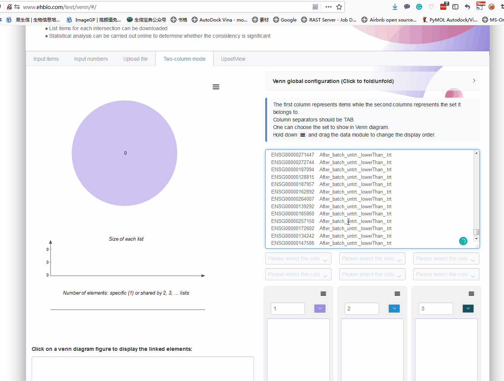
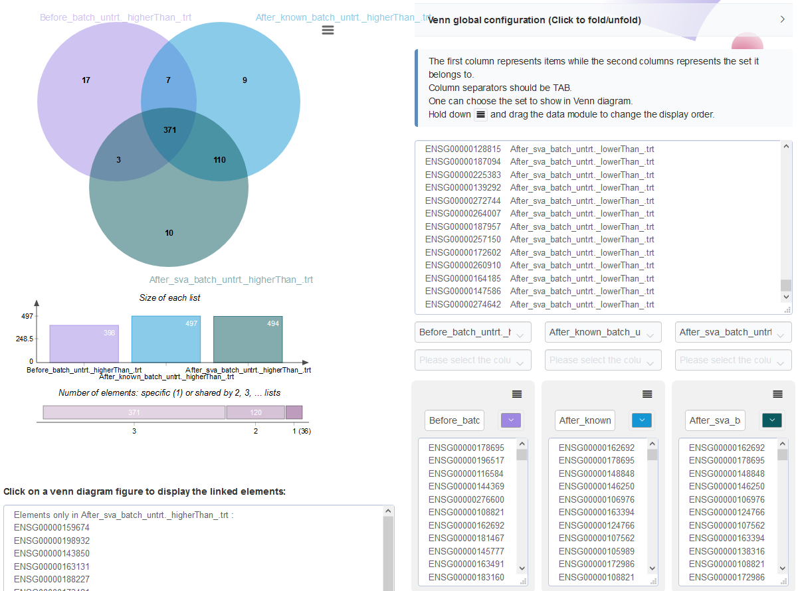
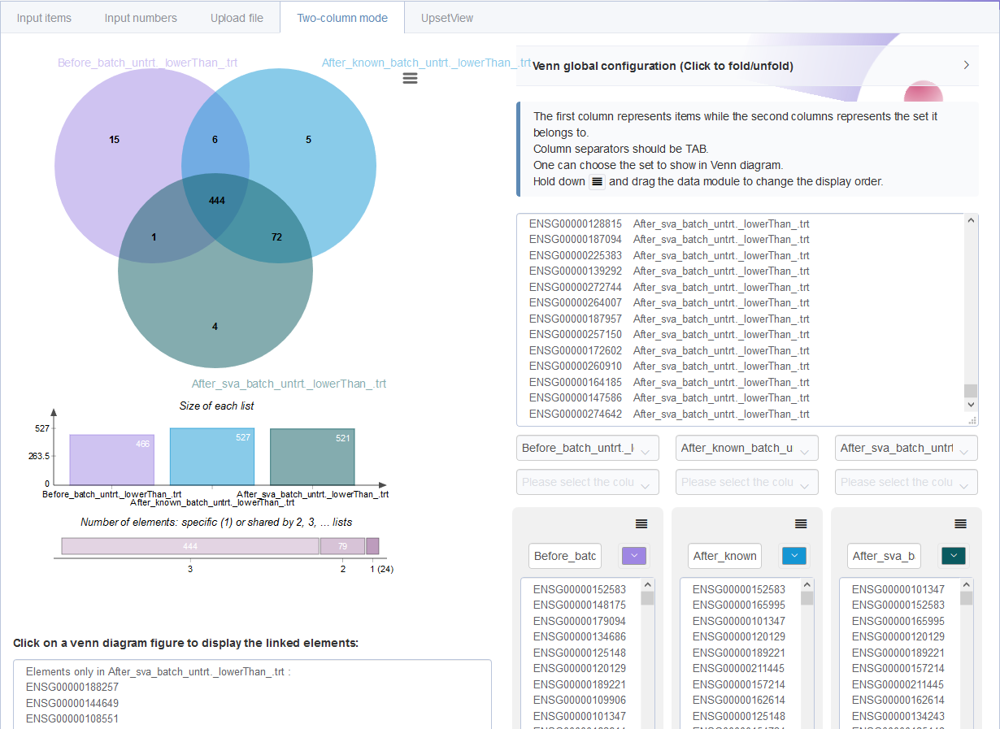

```{r, echo=F}
knitr::opts_chunk$set( echo = TRUE, message=FALSE, warning=FALSE, fig.width=8 )
```

下面我们以一个具体例子实战（配对样品处理前后基因表达的变化）和检验下效果。为了演示批次效应的影响，大部分代码做了封装，我们只关心核心的地方。如果自己对封装的代码感兴趣，可以自行查看函数源码。

## 检查有无缺失的包并安装，加载所有包

```{r}
site = "https://mirrors.tuna.tsinghua.edu.cn/CRAN"

if (!requireNamespace("BiocManager", quietly = TRUE))
  install.packages("BiocManager", repos = site)

options(BioC_mirror="https://mirrors.tuna.tsinghua.edu.cn/bioconductor")
installed_packages = data.frame(installed.packages())
a = rownames(installed_packages)

# 安装指定版本的ggbeeswarm
if (!"ggbeeswarm" %in% a){
   install.packages("https://cran.r-project.org/src/contrib/Archive/ggbeeswarm/ggbeeswarm_0.6.0.tar.gz", repos = NULL, type = "source")
} else {
  if (installed_packages["ggbeeswarm","Version"] != "0.6.0") {
    install.packages("https://cran.r-project.org/src/contrib/Archive/ggbeeswarm/ggbeeswarm_0.6.0.tar.gz", repos = NULL, type = "source")
  }
}

install_bioc <- c("tidyverse", "DESeq2", "RColorBrewer", "ggplot2", "org.Hs.eg.db",
                  "reshape2", "stringr", "gplots","tidyr","amap","BiocParallel","sva",
                  "ggfortify","patchwork", "ggrepel",
                  "VennDiagram","grid", "limma", 
                  "devtools","rmarkdown","dplyr","conflicted")


for (i in install_bioc) {
  if (!i %in% a){
    BiocManager::install(i, update = F, site_repository=site)
    a = rownames(installed.packages())
  }
}

if (!"ImageGP" %in% a){
  # devtools::install_github("Tong-Chen/ImageGP")
  devtools::install_git("https://gitee.com/ct5869/ImageGP.git")
}
```

```{r}
# 若缺少ImageGP包，则安装
# BiocManager::install("Tong-Chen/ImageGP", update=F)
suppressMessages(library(DESeq2))
suppressMessages(library("RColorBrewer"))
suppressMessages(library("gplots"))
suppressMessages(library("amap"))
suppressMessages(library("ggplot2"))
suppressMessages(library("BiocParallel"))
suppressMessages(library("ImageGP"))
suppressMessages(library(sva))
suppressMessages(library(ggfortify))
suppressMessages(library(patchwork))
# https://cran.r-project.org/src/contrib/Archive/ggbeeswarm/ggbeeswarm_0.6.0.tar.gz
suppressMessages(library(ggbeeswarm))
suppressMessages(library(ggrepel))
suppressMessages(library(VennDiagram))
suppressMessages(library(grid))
suppressMessages(library(limma))
suppressMessages(library(dplyr))
suppressMessages(library(conflicted))
conflict_prefer("select", "dplyr")
```

输入文件1： `reads count`矩阵 (*ehbio_trans.Count_matrix.txt*)，格式如下：

    ENSG    untrt_N61311    untrt_N052611   untrt_N080611   untrt_N061011   trt_N61311  trt_N052611 trt_N080611 trt_N061011
    ENSG00000223972 1   0   0   0   0   1   0   0
    ENSG00000227232 13  25  23  24  12  12  22  22
    ENSG00000278267 0   5   3   4   2   4   3   1

输入文件2： `实验设计信息`表 (*metadata*): `conditions`为处理条件（`untrt`是对照, `trt`是加药处理 ），`individual`标记样品的个体来源 (4个个体：N61311、N052611、N080611、N061011)。

    Samp    conditions  individual
    untrt_N61311    untrt   N61311
    untrt_N052611   untrt   N052611
    untrt_N080611   untrt   N080611
    untrt_N061011   untrt   N061011
    trt_N61311  trt N61311
    trt_N052611 trt N052611
    trt_N080611 trt N080611
    trt_N061011 trt N061011

## 不考虑批次因素直接进行差异基因分析 {#batch6}

初始化，定义输入、输出和参数

```{r}
# Prefix for all output file 
dir.create("result/batch", recursive = T)
output_prefix = "result/batch/ehbio.simpler"

# pipelineStar.sh或其它方式生成的reads count 文件，行为基因，列为样品
file = "22_star_deseq2_go/ehbio_trans.Count_matrix.txt"
# 分组信息表
metadata = "22_star_deseq2_go/metadata.txt"
# 分组信息所在列名字
covariate = NULL
# covariate = "batch"
design="conditions"
# 输入数据类型，salmon结果或reads count 矩阵
type="readscount"
# 差异基因参数
padj=0.05
log2FC=1
```

数据读入和标准化

```{r}
dds <- readscount2deseq(file, metadata, design=design, covariate = covariate)

normexpr <- deseq2normalizedExpr(dds, output_prefix=output_prefix, rlog=F, vst=T)
```

检查数据标准化效果: 标准化后基因在不同样品的表达分布越均一越好。从下图看不出存在批次效应的影响。

```{r}
# normalizedExpr2DistribBoxplot(normexpr, 
#   saveplot=paste(output_prefix, "DESeq2.normalizedExprDistrib.pdf", sep="."))
normalizedExpr2DistribBoxplot(normexpr)
```

[样本聚类](https://mp.weixin.qq.com/mp/appmsgalbum?__biz=MzI5MTcwNjA4NQ==&action=getalbum&album_id=1335864997100224512&subscene=38&scenenote=https%3A%2F%2Fmp.weixin.qq.com%2Fs%3F__biz%3DMzI5MTcwNjA4NQ%3D%3D%26mid%3D2247495133%26idx%3D2%26sn%3D37d1572211a755566b5de5f120e476cf%26chksm%3Dec0e2857db79a1411fab8405e9f6284f10644eb9965f2d5fdfa98f0ff44a581729f990fc9c14%26scene%3D38%26key%3Dbbd9db2a3d7572cd769c7f8e4e3317fec44d11168b996d9b03e0828fc8c61abdcf8565023bdb967b8005fb7f8f9d6e2f7cb5d24289c52229bae2b2791048ea213afbf98f447947495cde5742eae678a4%26ascene%3D7%26uin%3DOTY2MDEyMzgw%26devicetype%3DWindows%2B7%2Bx64%26version%3D62090529%26lang%3Dzh_CN%26exportkey%3DAa8iMQ%252BTtWiuSpqGzIiwmvk%253D%26pass_ticket%3DDAyFVADyPalxlkE8NUofnsSAhBBJHP7CYr46pHPxHfWOVdG1RLPhHzDUX%252BmMIHmH%26winzoom%3D1#wechat_redirect)查看样品相似性，trt组和untrt组区分明显 (*聚类采用的不同基因数目、聚类参数都可能影响聚类结果*)

```{r}
# clusterSampleHeatmap2(normexpr$vst, 
#                       cor_file=paste(output_prefix, "DESeq2.sampleCorrelation.txt", sep="."), 
#                       saveplot=paste(output_prefix, "DESeq2.sampleCorrelation.pdf", sep="."))
# 根据前5000个表达变化幅度最大的基因进行聚类分析
clusterSampleHeatmap2(normexpr$vst[1:5000,], cor_file=paste(output_prefix, "DESeq2.sampleCorrelation.txt", sep="."))
clusterSampleUpperTriPlot(normexpr$vst[1:500,], cor_file=paste(output_prefix, "DESeq2.sampleCorrelation.txt", sep="."))
```

[主成分分析PCA](https://mp.weixin.qq.com/s?__biz=MzI5MTcwNjA4NQ==&mid=2247489825&idx=1&sn=e56d490bec2bed4068cb2f294399e675&chksm=ec0ddcabdb7a55bd5ad91cc16c470250213d78c782da419e70039e851621525674203e47916f&scene=158#rd)查看样品相似性，发现在`PC1`轴上，样品按**处理条件**区分开；在`PC2`轴上，样品按**个体**区分开，不同的个体是影响样品基因表达差异的一个重要因素。

```{r}
metadata = as.data.frame(colData(dds))
sp_pca(normexpr$vst[1:1000,], metadata, color_variable="conditions", shape_variable = "individual") + aes(size=1) + guides(size = "none")
```

先鉴定出差异基因，获得差异基因文件`ehbio.simpler.DESeq2.all.DE.txt`和其它可视化图表（暂时忽略）。

```{r}
multipleGroupDEgenes(dds, design=design, output_prefix=output_prefix, padj=padj, log2FC=log2FC, normalized_counts=normexpr)
```

## 考虑已知的批次因素进行差异基因分析 {#batch7}

初始化，定义输入、输出和参数 （注意`covariate`变量使用`individual`列作为了批次信息）

```{r}
# Prefix for all output file 
dir.create("result/batch")
output_prefix = "result/batch/ehbio.simpler.batch"

# pipelineStar.sh生成的reads count 文件，行为基因，列为样品
file = "22_star_deseq2_go/ehbio_trans.Count_matrix.txt"
# 分组信息表
metadata = "22_star_deseq2_go/metadata.txt"
# 分组信息所在列名字
# covariate = NULL
# *********
covariate = "individual"
design="conditions"
# 输入数据类型，salmon结果或reads count 矩阵
type="readscount"
# 差异基因参数
padj=0.05
log2FC=1
```

数据读入和标准化，并检查数据标准化效果: 标准化后基因在不同样品的表达分布越均一越好 （此图略过，与上面的表达分布图一致）。

```{r}
dds <- readscount2deseq(file, metadata, design=design, covariate = covariate)
normexpr <- deseq2normalizedExpr(dds, output_prefix=output_prefix, rlog=F, vst=T)
normalizedExpr2DistribBoxplot(normexpr)
```

样本聚类查看样品相似性，trt组和untrt组区分明显 (此部分结果略过，与上面的聚类结果一致)

```{r}
# clusterSampleHeatmap2(normexpr$vst, 
#                       cor_file=paste(output_prefix, "DESeq2.sampleCorrelation.txt", sep="."), 
#                       saveplot=paste(output_prefix, "DESeq2.sampleCorrelation.pdf", sep="."))
# 根据前5000个表达变化幅度最大的基因进行聚类分析
clusterSampleHeatmap2(normexpr$vst[1:5000,], cor_file=paste(output_prefix, "DESeq2.sampleCorrelation.txt", sep="."))
clusterSampleUpperTriPlot(normexpr$vst[1:5000,], cor_file=paste(output_prefix, "DESeq2.sampleCorrelation.txt", sep="."))
```

主成分分析PCA查看样品相似性，发现在`PC1`轴上，样品按**处理条件**区分开；在`PC2`轴上，样品按**个体**区分开，表明不同的个体可能会对后续的差异基因分析造成影响。这个结果也与我们前面不考虑批次因素的结果是一样的。

```{r}
metadata = as.data.frame(colData(dds))
sp_pca(normexpr$vst[1:5000,], metadata, color_variable="conditions", shape_variable = "individual") + aes(size=1) + guides(size = "none")
```

是不是批次变量加错了呢，还是添加的批次变量未生效？可以说都不是，操作没问题，只是`DESeq2`处理时只在差异分析模型中考虑批次效应信息，而不会`直接校正表达矩阵`。那我们先看下加了批次后差异分析的结果怎样，后续我们再讲如何校正表达矩阵。

鉴定出差异基因，获得差异基因文件`ehbio.simpler.batch.DESeq2.all.DE.txt`和其它可视化图表（暂时忽略）。

```{r}
multipleGroupDEgenes(dds, design=design, output_prefix=output_prefix, padj=padj, log2FC=log2FC, normalized_counts=normexpr)
```

### 比较批次校正前后差异基因变化 {#batch8}

校正后，差异基因数目变多了，上调多了*99*个，下调多了*61*个。不过数目变化，也说明不了太多问题。

```{r}
de_before_batch = sp_readTable("result/batch/ehbio.simpler.DESeq2.all.DE.txt", header=F)
de_before_batch$V2 = paste("Before_batch",de_before_batch$V2,sep="_")
table(de_before_batch$V2)
```

```{r}
de_after_batch = sp_readTable("result/batch/ehbio.simpler.batch.DESeq2.all.DE.txt", header=F)
de_after_batch$V2 = paste("After_known_batch",de_after_batch$V2,sep="_")
table(de_after_batch$V2)
```

画个Venn图，看下哪些基因是新增的差异基因，哪些基因批次校正后没差异了。

```{r}
all_de = rbind(de_before_batch, de_after_batch)
# 随机查看6行，信息代表更全面
all_de[sample(1:nrow(all_de),6),]
# 结果存储到文件中
sp_writeTable(all_de, file="result/batch/Compare_de_gene_beofore_and_after_batch.txt", keep_rownames = F, col.names = F)
```

```{r}
sp_vennDiagram(all_de, label1="Before_batch_untrt._higherThan_.trt",
               label2="After_known_batch_untrt._higherThan_.trt")
```

采用在线工具<http://www.ehbio.com/test/venn/#/> 来做，准备在线工具所需的文件，一个两列格式的文件：第一列为基因名，第二列为基因的上下调状态。拷贝文件数据到网站数据输入处：



从Venn图可以看出，批次校正后既有新增的差异基因，又丢失了之前的一部分差异基因，那么哪个方式更合理呢？

选择1个批次校正后检测为上调的基因和1个批次校正后检测为下调的基因，观察下其表达模式。从下图可以看出，这些基因具有明显的个体表达一致性。`ENSG00000163394`基因在每个个体来源的样本中处理后表达都上调了近4倍，但是其本底表达在不同个体中却差异较大。如其在`N080611`个体（蓝色线）中表达整体偏低，药物处理后表达虽然有上调但表达值却低于其在`N061011`个体（绿色线）处理前的表达。从这两个例子可以看出，考虑到每个个体的基准表达水平不同，最终获得的差异倍数会有较高的方差。批次校正后解决了样品个体来源基因本底表达差异的影响，获得的差异基因倍数方差会变小，所以检测出更多差异基因，理论上也是更可靠的方式。（这个在之前文章[典型医学设计实验GEO数据分析 (step-by-step) - Limma差异分析、火山图、功能富集](https://mp.weixin.qq.com/s/PswNqmQ8mDleVE4yHtCvAQ)也有阐述。）

```{r}
ENSG00000163394 = data.frame(Expr=normexpr$vst["ENSG00000163394",])
sp_writeTable(ENSG00000163394, file="result/ENSG00000163394.txt")
p1 <- sp_boxplot(ENSG00000163394, melted=T, metadata=metadata, xvariable = "conditions", yvariable = "Expr", jitter_bp = T, group_variable_for_line = "individual", xvariable_order = c("untrt","trt"), manual_color_vector = "Set2")

ENSG00000221866 = data.frame(Expr=normexpr$vst["ENSG00000221866",])
p2 <- sp_boxplot(ENSG00000221866, melted=T, metadata=metadata, xvariable = "conditions", yvariable = "Expr", jitter_bp = T, group_variable_for_line = "individual", xvariable_order = c("untrt","trt"), manual_color_vector = "Set2")

p1 + p2 + plot_layout(guide = 'collect')
```


我们再选2个批次校正前鉴定为有差异、批次校正后鉴定为无差异的基因观察下其表达模式。这两个基因的表达模式没看出存在个体本底的一致变化差异。处理前后在不同个体中变化幅度不一，可能是被动变化。但这些基因一定是没有差异吗？我个人也下不出结论，后续得结合其功能再做判断了。

```{r}
ENSG00000109689 = data.frame(Expr=normexpr$vst["ENSG00000109689",])
p1 <- sp_boxplot(ENSG00000109689, melted=T, metadata=metadata, xvariable = "conditions", yvariable = "Expr", jitter_bp = T, group_variable_for_line = "individual", xvariable_order = c("untrt","trt"), manual_color_vector = "Set2", title="ENSG00000109689")

ENSG00000137124 = data.frame(Expr=normexpr$vst["ENSG00000137124",])
p2 <- sp_boxplot(ENSG00000137124, melted=T, metadata=metadata, xvariable = "conditions", yvariable = "Expr", jitter_bp = T, group_variable_for_line = "individual", xvariable_order = c("untrt","trt"), manual_color_vector = "Set2", title="ENSG00000137124")

p1 + p2 + plot_layout(guide = 'collect')
```

`DESeq2`，`edgeR`和`limma`在考虑批次因素鉴定差异基因时基本操作是一致的，上面我们也完成和比较了已知批次的数据的差异基因鉴定。

后续还有2个问题：

1.  DESeq2不校正表达矩阵自身的值，如果需要用到批次校正后的表达矩阵怎么做？
2.  如果不知道数据是否来源于同一个个体或是否有其他批次因素的影响，怎么处理？

## 批次效应未知时如何判断和在差异基因鉴定过程中移除批次效应 {#batch9}

前面文章讲述了批次信息已知时，在差异基因分析中考虑批次效应的影响可以移除部分基因在个体中不同本底表达水平差异的影响，获得的差异基因倍数方差会变小，可以检测出更多差异基因，理论上也是更可靠的方式。那么如果批次信息未知或记录不完善时怎么处理呢？

这里我们就用到了另一个 R 包`sva`帮助从数据中预测可能存在的混杂因素包括但不限于批次效应的影响。下面我们实际看下这个包鉴定出的*混杂因素与批次效应变量*之间是否存在关联？利用预测出的混杂因素作为批次信息校正后结果会有什么变化？

### 预测混杂因素(cofounding factors)并在差异基因分析中移除这些因素 {#batch10}

初始化，定义输入、输出和参数

```{r}
# Prefix for all output file 
output_prefix = "result/batch/ehbio.simpler.sva_batch"

# pipelineStar.sh或其它方式生成的reads count 文件，行为基因，列为样品
file = "22_star_deseq2_go/ehbio_trans.Count_matrix.txt"
# 分组信息表
metadata = "22_star_deseq2_go/metadata.txt"
# 分组信息所在列名字
covariate = NULL
# covariate = "batch"
design="conditions"
# 输入数据类型，salmon结果或reads count 矩阵
type="readscount"
# 差异基因参数
padj=0.05
log2FC=1
```

数据读入和标准化

```{r}
dds <- readscount2deseq(file, metadata, design=design, covariate = covariate)
normexpr <- deseq2normalizedExpr(dds, output_prefix=output_prefix, rlog=F, vst=T)
```

### 预测可能存在的混杂因素 {#batch11}

下面的方式也可以 (`svaseq` 是在 `sva` 的基础上对数据做了一个 `log` 转换；如果处理的是芯片数据，通常已经做过 log 换，直接使用 `sva` 即可)。

```{r}
# 获取标准化后的表达矩阵
dat <- normexpr$vst
# 根据关键生物表型构建设计矩阵
mod  <- model.matrix(as.formula(paste0("~ ", design)), colData(dds))
# 构建对照设计矩阵
mod0 <- model.matrix(~ 1, colData(dds))
# 指定混杂因素的数目为 2，也可以让 sva 自己预测
svseq2 <- sva(dat, mod, mod0)

svs <- svseq2$sv
colnames(svs) <- paste0("SV",1:ncol(svs))
svs
```

添加预测出的`Surrogate variable`属性到dds对象

```{r}
colData(dds) <- cbind(colData(dds), svs)
design(dds) <- as.formula(paste("~", paste(colnames(svs), collapse = "+"), "+", design))
# 基于预测出的混杂因素再次进行分析
dds <- DESeq(dds)
```

### 可视化展示预测出的`Surrogate variable`属性与已知的批次信息的关系

```{r}
plot_data <- as.data.frame(colData(dds))
plot_data$Sample <- rownames(plot_data)
head(plot_data)
sp_writeTable(plot_data, file="result/batch/metadata2.txt")
```

从下图可以看出，预测出的混杂因素`SV1`, `SV2`与样品来源的个体信息 (`individual`)还是比较一致的。

```{r, width=15, height=10}
p1 <- ggplot(plot_data, aes(x=SV1, y=SV2, color=conditions, shape=individual)) + 
	geom_point() + geom_text_repel(aes(label=Sample), show.legend = F)
p2 <- ggplot(plot_data, aes(x=SV1, y=SV3, color=conditions, shape=individual)) + 
	geom_point() + geom_text_repel(aes(label=Sample), show.legend = F)

p1+p2
```

### 基于预测出的混杂因素再次进行差异分析

获得差异基因文件`ehbio.simpler.sva_batch.DESeq2.all.DE.txt`和其它可视化图表（暂时忽略）。

```{r}
multipleGroupDEgenes(dds, design=design, output_prefix=output_prefix, padj=padj, log2FC=log2FC, normalized_counts=normexpr)
```

### 比较批次校正前、已知批次校正后和预测的批次校正后差异基因变化 {#batch12}

根据已知批次信息校正后差异基因数目变多了，上调了*99*个，下调多了*61*个。根据预测的混杂因素校正后，上调多了*96*个，下调多了*55*个。从数目上看，根据已知批次和预测的混杂因素获得的差异基因是基本已知的。

```{r}
de_before_batch = sp_readTable("result/batch/ehbio.simpler.DESeq2.all.DE.txt", header=F)
de_before_batch$V2 = paste("Before_batch",de_before_batch$V2,sep="_")
table(de_before_batch$V2)
```

```{r}
de_after_known_batch = sp_readTable("result/batch/ehbio.simpler.batch.DESeq2.all.DE.txt", header=F)
de_after_known_batch$V2 = paste("After_known_batch",de_after_known_batch$V2,sep="_")
table(de_after_known_batch$V2)
```

```{r}
de_after_sva_batch = sp_readTable("result/batch/ehbio.simpler.sva_batch.DESeq2.all.DE.txt", header=F)
de_after_sva_batch$V2 = paste("After_sva_batch",de_after_sva_batch$V2,sep="_")
table(de_after_sva_batch$V2)
```

画个Venn图，看下哪些基因是新增的差异基因，哪些基因批次校正后没差异了。

```{r}
all_de = rbind(de_before_batch, de_after_known_batch, de_after_sva_batch)
# 随机查看6行，信息代表更全面
all_de[sample(1:nrow(all_de),6),]
# 结果存储到文件中
sp_writeTable(all_de, file="result/batch/Compare_de_gene_beofore_and_after_known_sva_batch.txt", keep_rownames = F, col.names = F)
```

一个方式是采用代码，直接出图

```{r}
suppressMessages(library(VennDiagram))
suppressMessages(library(grid))
sp_vennDiagram(all_de, label3="Before_batch_untrt._higherThan_.trt",
               label1="After_known_batch_untrt._higherThan_.trt",
               label2="After_sva_batch_untrt._higherThan_.trt")
```

这里还是采用在线工具<http://www.ehbio.com/test/venn/#/> 来做，能直接获得每个子集的基因，准备在线工具所需的文件，一个两列格式的文件：第一列为基因名，第二列为基因的上下调状态。

拷贝文件数据到网站数据输入处 （操作就不演示了看上一篇文章）：



从untrt上调基因Venn图可以看出，校正已知批次信息后既有新增的untrt上调差异基因，又丢失了之前的一部分untrt上调差异基因；校正预测的混杂因素后，大部分新增差异基因都与已知批次信息校正后的结果一致，但新增untrt上调差异基因少。



从untrt下调基因Venn图可以看出，校正预测的混杂因素后，新增39个差异基因；批次校正前鉴定为存在差异的40个基因在校正后被认为是非差异显著基因。

下面还是从这些基因的表达模式上看是否可以找到一些线索？

下图比对绘出了**7**种不同类型untrt上调的差异基因中随机选取1个绘制的表达模式比较图。

```{r fig.width=10, fig.height=12}
untrt_up_genes <- "Name;Type
ENSG00000159674;SVA_batch_specific
ENSG00000220563;SVA_batch_uncorrect_common
ENSG00000109689;Uncorrect_specific
ENSG00000162407;Known_batch_uncorrect_common
ENSG00000184254;Known_batch_specific
ENSG00000163394;Known_batch_SVA_batch_common
ENSG00000178695;All_common"

untrt_up_genes <- read.table(text=untrt_up_genes, sep=";", header=T, row.names=NULL)

untrt_up_genes_expr <- merge(untrt_up_genes, normexpr$vst, by.x="Name", by.y=0, all.x=T)

untrt_up_genes_expr_long <- reshape2::melt(untrt_up_genes_expr, id_vars=c("Name","Type"), 
                                 variable.name="Sample", value.name = "Expr")

head(untrt_up_genes_expr_long)

# metadata$Sample = rownames(metadata)

ImageGP:::sp_writeTable(untrt_up_genes_expr_long, file="1", keep_rownames =F)

sp_boxplot(untrt_up_genes_expr_long, melted=T, metadata=plot_data, 
           xvariable = "conditions", yvariable = "Expr", jitter_bp = T, 
           group_variable_for_line = "individual", 
           facet_variable = "Type", facet_scales="free_y", legend.position = c(0.7,0.15), 
           x_label="",manual_color_vector = "Set2") + 
  theme(legend.direction = "horizontal")
```

`All_common`代表了差异倍数特别大的基因，不论是否校正都可以检测出差异；不同类型批次信息校正后被检测视为差异的基因都有表达的本底差异；`Uncorrect_specific`的基因本底表达无固定模式。

下图比对绘出了**7**种不同类型untrt下调的差异基因表达分布，基本结论与上图类似。

```{r fig.width=10, fig.height=12}
untrt_down_genes <- "Name;Type
ENSG00000188257;SVA_batch_specific
ENSG00000117479;SVA_batch_uncorrect_common
ENSG00000137124;Uncorrect_specific
ENSG00000254109;Known_batch_uncorrect_common
ENSG00000113578;Known_batch_specific
ENSG00000221866;Known_batch_SVA_batch_common
ENSG00000152583;All_common"

untrt_down_genes <- read.table(text=untrt_down_genes, sep=";", header=T, row.names=NULL)

untrt_down_genes_expr <- merge(untrt_down_genes, normexpr$vst, by.x="Name", by.y=0, all.x=T)

untrt_down_genes_expr_long <- reshape2::melt(untrt_down_genes_expr, id_vars=c("Name","Type"), 
                                 variable.name="Sample", value.name = "Expr")

head(untrt_down_genes_expr_long)

metadata$Sample = rownames(metadata)

sp_boxplot(untrt_down_genes_expr_long, melted=T, metadata=plot_data, 
           xvariable = "conditions", yvariable = "Expr", jitter_bp = T, 
           group_variable_for_line = "individual", 
           facet_variable = "Type", facet_scales="free_y", legend.position = c(0.7,0.15), 
           x_label="",manual_color_vector = "Set2") + 
  theme(legend.direction = "horizontal")
```

额外的一个信息是`SVA_batch_speific`中红色和绿色个体本底表达区分不明显。这可能是基于SVA预测的混杂因素与已知的批次因素校正后结果有差异的一个原因 (这两个个体的SV值很接近)。

另外一个导致SVA预测的批次与已知的批次效应校正后结果不同的原因也可能是我们只让`SVA`预测了2个混杂因素。留下2个去探索的问题，欢迎留言或投稿讨论：

1.  如果不设置只返回两个混杂因素，实际SVA会判断出存在3个混杂因素，全部混杂因素都考虑进去结果会有什么变化呢？
2.  上面是取了单个基因查看其表达模式，还可以进一步比较不同子集的基因表达水平、差异倍数、FDR、差异倍数方差的整体分布，分析受影响的主要是哪些类型的基因？

## 直接校正表达矩阵 {#batch13}

处理批次因素最好的方式还是如前面所述将其整合到差异基因鉴定模型中，降低批次因素带来的模型残差的自由度。但一些下游分析，比如数据可视化，也需要直接移除效应影响的数据来展示，这时可以使用`ComBat`或`removeBatchEffect`函数来处理。

输入数据，标准化且log转换后的数据 `ehbio.simpler.DESeq2.normalized.vst.txt`

    id  untrt_N61311    untrt_N052611   untrt_N080611   untrt_N061011   trt_N61311  trt_N052611 trt_N080611 trt_N061011
    ENSG00000115414 18.02   18.62   17.83   18.45   17.95   18.54   18.15   18.50 
    ENSG00000011465 17.79   18.36   17.96   18.52   17.79   18.23   17.84   18.47 
    ENSG00000091986 17.15   17.74   16.41   17.59   17.27   17.79   16.88   17.76 
    ENSG00000103888 15.56   16.90   15.88   16.42   15.94   17.43   17.38   17.05 

包含已知批次信息和预测的批次信息的样本属性文件 `metadata2`

    Samp    conditions  individual  sizeFactor  SV1 SV2 SV3
    untrt_N61311    untrt   N61311  1.0211325   -0.10060313 -0.4943517  -0.31643389
    untrt_N052611   untrt   N052611 1.1803986   0.01827734  -0.1701068  0.58841464
    untrt_N080611   untrt   N080611 1.1796083   -0.42949195 0.3756338   -0.08929556
    untrt_N061011   untrt   N061011 0.9232642   0.53452392  0.2413738   -0.17649091
    trt_N61311  trt N61311  0.8939275   -0.12535603 -0.4956603  -0.36550102
    trt_N052611 trt N052611 0.6709229   0.03588273  -0.151201   0.5914179
    trt_N080611 trt N080611 1.3967665   -0.46668403 0.4413431   -0.07016903
    trt_N061011 trt N061011 0.9462307   0.53345114  0.2529692   -0.16194213

### 读入标准化后的表达矩阵和样品信息表

```{r}
expr_File <- "result/batch/ehbio.simpler.DESeq2.normalized.vst.txt"
expr_mat <- sp_readTable(expr_File, row.names=1)

head(expr_mat)

metadata <- "result/batch/metadata2.txt"
metadata <- sp_readTable(metadata, row.names=1)
head(metadata)
```

### 使用ComBat校正 {#batch14}

ComBat校正时考虑生物分组信息

```{r}
biological_group = "conditions"
batch = "individual"

metadata[[biological_group]] <- factor(metadata[[biological_group]])
metadata[[batch]] <- factor(metadata[[batch]])

# 模型中引入关注的生物变量和其它非批次变量，保留生物差异和非批次差异
modcombat = model.matrix(as.formula(paste('~', biological_group, sep=" ")), data=
metadata)

# ComBat需要的是matrix
expr_mat_batch_correct <- ComBat(dat=as.matrix(expr_mat), batch=metadata[[batch]], mod=modcombat)
expr_mat_batch_correct <- as.data.frame(expr_mat_batch_correct)

expr_mat_batch_correct[1:3,1:4]
```

#### 校正后的PCA

PCA结果显示在`PC1`轴代表的差异变大了，`PC2`轴代表的差异变小了，不同来源的样本在`PC2`轴的分布没有规律了 (或者说成镜像分布了)。

```{r}
sp_pca(expr_mat_batch_correct[1:5000,], metadata, 
       color_variable="conditions", shape_variable = "individual") +
  aes(size=1) + guides(size = "none")
```

ComBat校正时不考虑分组信息，也可以获得一个合理的结果，但是一部分组间差异被抹去了。

```{r}
# ComBat需要的是matrix
expr_mat_batch_correct2 <- ComBat(dat=as.matrix(expr_mat), batch=metadata[[batch]], mod=NULL)
expr_mat_batch_correct2 <- as.data.frame(expr_mat_batch_correct2)

sp_pca(expr_mat_batch_correct2[1:5000,], metadata, 
       color_variable="conditions", shape_variable = "individual") +
  aes(size=1) + guides(size = "none") 
```

关于运行`ComBat`时是否应该添加关注的生物分组信息，即`mod`变量，存在一些争议。反对添加`mod`的人的担心是这么处理后，是否会强化生物分组之间的差异。支持添加`mod`的人是担心如果不添加`mod`那么去除批次时可能也会去除样本组之间的差异，尤其是实验设计不合理时。

如果是非平衡实验，类似我们在实验设计部分时提到的方案2，则没有办法添加`mod`变量，程序会报出`Design matrix is not full rank`类似的错误，这时是不能区分差异是来源于批次还是来源于样本，强行移除批次时，也会移除一部分或者全部样本分组带来的差异。这个在第一篇帖子处有两位朋友的留言讨论可以参考。

`ComBat`只能处理批次信息为l离散型分组变量的数据，不能处理`sva`预测出的连续性混杂因素。

### 使用limma校正 {#batch15}

如果批次信息有多个或者不是分组变量而是类似`SVA`预测出的数值混杂因素，则需使用`limma`的`removeBatchEffect` (这里使用的是`SVA`预测出的全部3个混杂因素进行的校正。)。

样品在`PC1`和`PC2`组成的空间的分布与`ComBat`结果类似，只是`PC1`能解释的差异略小一些。

```{r}
SV = metadata[,c("SV1","SV2","SV3")]
expr_mat_batch_correct_limma1 <- removeBatchEffect(expr_mat, covariates = SV, design=modcombat)
sp_pca(expr_mat_batch_correct_limma1[1:5000,], metadata, 
       color_variable="conditions", shape_variable = "individual") +
  aes(size=1) + guides(size = "none") 
```

`removeBatchEffect`运行时也可以不提供生物分组信息。

```{r}
expr_mat_batch_correct_limma1 <- removeBatchEffect(expr_mat, covariates = SV)
sp_pca(expr_mat_batch_correct_limma1[1:5000,], metadata, 
       color_variable="conditions", shape_variable = "individual") +
  aes(size=1) + guides(size = "none") 
```

`removeBatchEffect`也可以跟`ComBat`一样，对给定的已知一个或多个定性批次信息进行校正。

```{r}
expr_mat_batch_correct_limma2 <- removeBatchEffect(expr_mat, batch=metadata[[batch]], design=modcombat)
sp_pca(expr_mat_batch_correct_limma2[1:5000,], metadata, 
       color_variable="conditions", shape_variable = "individual") +
  aes(size=1) + guides(size = "none") 
```

不指定目标分组变量，结果也不受影响。

```{r}
expr_mat_batch_correct_limma2 <- removeBatchEffect(expr_mat, batch=metadata[[batch]])
sp_pca(expr_mat_batch_correct_limma2[1:5000,], metadata, 
       color_variable="conditions", shape_variable = "individual") +
  aes(size=1) + guides(size = "none") 
```

### 查看校正完后基因的表达情况

```{r fig.width=10, fig.height=12}
untrt_down_genes <- "Name;Type
ENSG00000144649;SVA_batch_specific
ENSG00000187134;SVA_batch_uncorrect_common
ENSG00000137124;Uncorrect_specific
ENSG00000151690;Known_batch_uncorrect_common
ENSG00000180914;Known_batch_specific
ENSG00000221866;Known_batch_SVA_batch_common
ENSG00000152583;All_common"

untrt_down_genes <- read.table(text=untrt_down_genes, sep=";", header=T, row.names=NULL)

untrt_down_genes_expr <- merge(untrt_down_genes, expr_mat_batch_correct, by.x="Name", by.y=0, all.x=T)

untrt_down_genes_expr_long <- reshape2::melt(untrt_down_genes_expr, id_vars=c("Name","Type"), 
                                 variable.name="Sample", value.name = "Expr")

head(untrt_down_genes_expr_long)

#metadata$Sample = rownames(metadata)

sp_boxplot(untrt_down_genes_expr_long, melted=T, metadata=plot_data, 
           xvariable = "conditions", yvariable = "Expr", jitter_bp = T, 
           group_variable_for_line = "individual", 
           facet_variable = "Type", facet_scales="free_y", legend.position = c(0.7,0.1), 
           x_label="",manual_color_vector = "Set2") + 
  theme(legend.direction = "horizontal")
```

```{r fig.width=10}
untrt_down_genes <- "Name;Type
ENSG00000144649;SVA_batch_specific
ENSG00000187134;SVA_batch_uncorrect_common
ENSG00000137124;Uncorrect_specific
ENSG00000151690;Known_batch_uncorrect_common
ENSG00000180914;Known_batch_specific
ENSG00000221866;Known_batch_SVA_batch_common
ENSG00000152583;All_common"

untrt_down_genes <- read.table(text=untrt_down_genes, sep=";", header=T, row.names=NULL)

untrt_down_genes_expr <- merge(untrt_down_genes, expr_mat_batch_correct_limma1, by.x="Name", by.y=0, all.x=T)

untrt_down_genes_expr_long <- reshape2::melt(untrt_down_genes_expr, id_vars=c("Name","Type"), 
                                 variable.name="Sample", value.name = "Expr")

head(untrt_down_genes_expr_long)

# metadata$Sample = rownames(metadata)

sp_boxplot(untrt_down_genes_expr_long, melted=T, metadata=plot_data, 
           xvariable = "conditions", yvariable = "Expr", jitter_bp = T, 
           group_variable_for_line = "individual", 
           facet_variable = "Type", facet_scales="free_y", legend.position = c(0.7,0.1), 
           x_label="",manual_color_vector = "Set2") + 
  theme(legend.direction = "horizontal")
```
