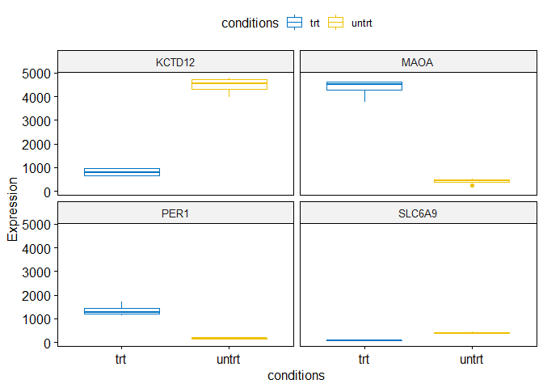

## 加载需要的包


```r
site = "https://mirrors.tuna.tsinghua.edu.cn/CRAN"

if (!requireNamespace("BiocManager", quietly = TRUE)) install.packages("BiocManager", repos = site)

a = rownames(installed.packages())

install_bioc <- c("ggExtra", "ggpur", "ggstatsplot", "Hmisc", "tidyr", "ggcorrplot")

for (i in install_bioc) {
    if (!i %in% a)
        BiocManager::install(i, update = F)
}
```

```
## package 'ggcorrplot' successfully unpacked and MD5 sums checked
## 
## The downloaded binary packages are in
## 	C:\Users\Administrator\AppData\Local\Temp\RtmpcT2HM5\downloaded_packages
```

```r
if (!"ImageGP" %in% a) {
    # devtools::install_github('Tong-Chen/ImageGP')
    devtools::install_git("https://gitee.com/ct5869/ImageGP.git")
}
```


```r
library(dplyr)
library(ggpubr)
library(tidyr)
library(ggplot2)
library(pheatmap)
library(ggstatsplot)
library(Hmisc)
```

## 读入数据

### Duplicate row names


```r
expr <- read.table("ehbio.simplier.DESeq2.normalized.symbol.txt", row.names = 1, header = T, sep = "\t")
```

### 行名唯一化处理

这里使用`make.names`转换行名为唯一，实际需要先弄清楚为什么会有重复名字。


```r
expr <- read.table("ehbio.simplier.DESeq2.normalized.symbol.txt", row.names = NULL, header = T, sep = "\t")
head(expr)
```

<div class="kable-table">

|id     | untrt_N61311| untrt_N052611| untrt_N080611| untrt_N061011| trt_N61311| trt_N052611| trt_N080611| trt_N061011|
|:------|------------:|-------------:|-------------:|-------------:|----------:|-----------:|-----------:|-----------:|
|FN1    |    245667.66|      427435.1|     221687.51|      371144.2|  240187.24|   450103.21|   280226.19|   376518.23|
|DCN    |    212953.14|      360796.2|     258977.30|      408573.1|  210002.18|   316009.14|   225547.39|   393843.74|
|CEMIP  |     40996.34|      137783.1|      53813.92|       91066.8|   62301.12|   223111.85|   212724.84|   157919.47|
|CCDC80 |    137229.15|      232772.2|      86258.13|      212237.3|  136730.76|   226070.89|   124634.56|   236237.81|
|IGFBP5 |     77812.65|      288609.2|     210628.87|      168067.4|   96021.74|   217439.21|   162677.38|   168387.36|
|COL1A1 |    146450.41|      127367.3|     152281.50|      140861.1|   62358.64|    53800.47|    69160.97|    51044.06|

</div>

有哪些基因名是重复出现的？


```r
expr$id[duplicated(expr$id)]
```

```
##   [1] "MATR3"      "PKD1P1"     "HSPA14"     "OR7E47P"    "POLR2J3"   
##   [6] "ATXN7"      "TMSB15B"    "LINC-PINT"  "TBCE"       "SNX29P2"   
##  [11] "SCO2"       "POLR2J4"    "CCDC39"     "RGS5"       "BMS1P21"   
##  [16] "RF00017"    "GOLGA8M"    "RF00017"    "DNAJC9-AS1" "CYB561D2"  
##  [21] "RF00017"    "IPO5P1"     "RF00017"    "RF00017"    "RF00017"   
##  [26] "SPATA13"    "RF00017"    "RF00017"    "RF00017"    "RF00017"   
##  [31] "RF00017"    "RF00017"    "RF00017"    "RF00017"    "RF00017"   
##  [36] "RF00017"    "RF00017"    "RF00017"    "RF00017"    "RF00017"   
##  [41] "RF00019"    "RF00019"    "RF00017"    "RF00017"    "RF00017"   
##  [46] "RF00019"    "BMS1P4"     "RF00019"    "RF00019"    "RF00017"   
##  [51] "RF00017"    "RF00017"    "RF00017"    "RF00017"    "RF00017"   
##  [56] "RF00017"    "RF00017"    "RF00017"    "RF00017"    "RF00017"   
##  [61] "RF00017"    "RF00017"    "RF00017"    "RF00019"    "RF00017"   
##  [66] "RF00017"    "RF00017"    "RF00019"    "RF00017"    "RF00017"   
##  [71] "LINC01238"  "RF00017"    "RF00017"    "RF00017"    "RF00017"   
##  [76] "RF00017"    "RF00017"    "RF00017"    "RF00017"    "RF00017"   
##  [81] "RF00017"    "RF00017"    "RF02271"    "RF00017"    "RF00017"   
##  [86] "RF00017"    "RF00017"    "RF00017"    "LINC01297"  "RF00019"   
##  [91] "RF00017"    "RF00012"    "RF00019"    "RF00017"    "RF00017"   
##  [96] "RF00019"    "RF00017"    "RF00017"    "RF00017"    "ZNF503"    
## [101] "RF00017"    "RF00017"    "RF00017"    "RF00017"    "RF00017"   
## [106] "RF00017"    "RF00017"    "RF00017"    "RF02271"    "RF00019"   
## [111] "RF00019"    "RF00017"    "RF00019"    "RF02271"    "RF00017"   
## [116] "RF00017"    "RF00017"    "RF00017"    "RF00019"    "RF00019"   
## [121] "RF00017"    "RF00019"    "ITFG2-AS1"  "RF00019"    "RF00019"   
## [126] "RF00017"    "RF00019"    "RF00017"    "RF00017"    "RF00017"   
## [131] "RF00019"    "RF00017"    "RF00012"    "RF00017"    "RF00017"   
## [136] "RAET1E-AS1" "RF00017"    "RF00017"    "RF00017"    "RF00017"   
## [141] "RF00017"    "RF00017"    "RF00017"    "RF00017"    "RF00012"   
## [146] "RF02271"    "RF00019"    "LINC01422"  "RF02271"    "RF00017"   
## [151] "RF00019"    "RF00019"    "RF00019"    "RF00019"    "RF00017"   
## [156] "LINC01481"  "RF00017"    "SNHG28"     "RF00019"    "RF00019"   
## [161] "RF00019"    "RF00019"    "LINC00484"  "LINC00941"  "ALG1L9P"   
## [166] "RF00017"    "DUXAP8"     "RF00017"    "RF00017"    "RF00017"   
## [171] "RF00017"    "RF00017"    "RF00017"    "RMRP"       "RF00017"   
## [176] "RF00017"    "RF00017"    "RF00017"    "DIABLO"
```

名字唯一化处理


```r
make.names(c("a", "a", "b", "b", "b"), unique = T)
```

```
## [1] "a"   "a.1" "b"   "b.1" "b.2"
```


```r
expr_names <- make.names(expr$id, unique = T)
rownames(expr) <- expr_names
expr <- expr[, -1]
head(expr)
```

<div class="kable-table">

|       | untrt_N61311| untrt_N052611| untrt_N080611| untrt_N061011| trt_N61311| trt_N052611| trt_N080611| trt_N061011|
|:------|------------:|-------------:|-------------:|-------------:|----------:|-----------:|-----------:|-----------:|
|FN1    |    245667.66|      427435.1|     221687.51|      371144.2|  240187.24|   450103.21|   280226.19|   376518.23|
|DCN    |    212953.14|      360796.2|     258977.30|      408573.1|  210002.18|   316009.14|   225547.39|   393843.74|
|CEMIP  |     40996.34|      137783.1|      53813.92|       91066.8|   62301.12|   223111.85|   212724.84|   157919.47|
|CCDC80 |    137229.15|      232772.2|      86258.13|      212237.3|  136730.76|   226070.89|   124634.56|   236237.81|
|IGFBP5 |     77812.65|      288609.2|     210628.87|      168067.4|   96021.74|   217439.21|   162677.38|   168387.36|
|COL1A1 |    146450.41|      127367.3|     152281.50|      140861.1|   62358.64|    53800.47|    69160.97|    51044.06|

</div>

## 热图绘制


```r
library(pheatmap)
top6 <- head(expr)
pheatmap(top6)
```

<!-- -->
### 提取差异基因绘制热图

读入差异基因列表


```r
de_gene <- read.table("ehbio.DESeq2.all.DE.symbol", row.names = NULL, header = F, sep = "\t")
head(de_gene)
```

<div class="kable-table">

|V1      |V2                     |
|:-------|:----------------------|
|ARHGEF2 |untrt._higherThan_.trt |
|KCTD12  |untrt._higherThan_.trt |
|SLC6A9  |untrt._higherThan_.trt |
|GXYLT2  |untrt._higherThan_.trt |
|RAB7B   |untrt._higherThan_.trt |
|NEK10   |untrt._higherThan_.trt |

</div>

提取Top3 差异的基因


```r
top6_de_gene <- de_gene %>%
    group_by(V2) %>%
    slice(1:3)
top6 <- expr[which(rownames(expr) %in% top6_de_gene$V1), ]
head(top6)
```

<div class="kable-table">

|        | untrt_N61311| untrt_N052611| untrt_N080611| untrt_N061011| trt_N61311| trt_N052611| trt_N080611| trt_N061011|
|:-------|------------:|-------------:|-------------:|-------------:|----------:|-----------:|-----------:|-----------:|
|KCTD12  |   4700.79369|     3978.0401|    4416.15169|    4792.34174|  936.69481|    633.4462|   979.77576|   641.49582|
|MAOA    |    438.54451|      452.9934|     516.63033|     258.73279| 4628.00860|   4429.7201|  4629.66529|  3778.17351|
|ARHGEF2 |   3025.62334|     3105.7830|    3094.51304|    2909.99043| 1395.39850|   1441.9916|  1464.59769|  1501.51509|
|SPARCL1 |     58.15705|      102.5827|      80.00997|      82.59042| 2220.50867|   1750.9879|  1374.90745|  2194.58930|
|PER1    |    170.61639|      156.3692|     194.97497|     123.47689| 1728.38117|   1230.2575|  1120.00650|  1333.91208|
|SLC6A9  |    360.66314|      413.8797|     365.47650|     443.71982|   63.90538|     56.8962|    86.82929|    95.33916|

</div>


```r
metadata <- read.table("sampleFile", header = T, row.names = 1)
pheatmap(top6, annotation_col = metadata)
```

<!-- -->

按行标准化


```r
pheatmap(top6, annotation_col = metadata, scale = "row", cluster_cols = F)
```

<!-- -->

## 箱线图和统计比较


```r
head(top6)
```

<div class="kable-table">

|        | untrt_N61311| untrt_N052611| untrt_N080611| untrt_N061011| trt_N61311| trt_N052611| trt_N080611| trt_N061011|
|:-------|------------:|-------------:|-------------:|-------------:|----------:|-----------:|-----------:|-----------:|
|KCTD12  |   4700.79369|     3978.0401|    4416.15169|    4792.34174|  936.69481|    633.4462|   979.77576|   641.49582|
|MAOA    |    438.54451|      452.9934|     516.63033|     258.73279| 4628.00860|   4429.7201|  4629.66529|  3778.17351|
|ARHGEF2 |   3025.62334|     3105.7830|    3094.51304|    2909.99043| 1395.39850|   1441.9916|  1464.59769|  1501.51509|
|SPARCL1 |     58.15705|      102.5827|      80.00997|      82.59042| 2220.50867|   1750.9879|  1374.90745|  2194.58930|
|PER1    |    170.61639|      156.3692|     194.97497|     123.47689| 1728.38117|   1230.2575|  1120.00650|  1333.91208|
|SLC6A9  |    360.66314|      413.8797|     365.47650|     443.71982|   63.90538|     56.8962|    86.82929|    95.33916|

</div>


矩阵转置


```r
top6_t <- as.data.frame(t(top6))
top6_t
```

<div class="kable-table">

|              |    KCTD12|      MAOA|  ARHGEF2|    SPARCL1|      PER1|    SLC6A9|
|:-------------|---------:|---------:|--------:|----------:|---------:|---------:|
|untrt_N61311  | 4700.7937|  438.5445| 3025.623|   58.15705|  170.6164| 360.66314|
|untrt_N052611 | 3978.0401|  452.9934| 3105.783|  102.58269|  156.3692| 413.87971|
|untrt_N080611 | 4416.1517|  516.6303| 3094.513|   80.00997|  194.9750| 365.47650|
|untrt_N061011 | 4792.3417|  258.7328| 2909.990|   82.59042|  123.4769| 443.71982|
|trt_N61311    |  936.6948| 4628.0086| 1395.398| 2220.50867| 1728.3812|  63.90538|
|trt_N052611   |  633.4462| 4429.7201| 1441.992| 1750.98786| 1230.2575|  56.89620|
|trt_N080611   |  979.7758| 4629.6653| 1464.598| 1374.90745| 1120.0065|  86.82929|
|trt_N061011   |  641.4958| 3778.1735| 1501.515| 2194.58930| 1333.9121|  95.33916|

</div>

与样本属性信息合并


```r
top6_t_with_group <- merge(metadata, top6_t, by = 0)
head(top6_t_with_group)
```

<div class="kable-table">

|Row.names     |conditions |    KCTD12|      MAOA|  ARHGEF2|    SPARCL1|      PER1|    SLC6A9|
|:-------------|:----------|---------:|---------:|--------:|----------:|---------:|---------:|
|trt_N052611   |trt        |  633.4462| 4429.7201| 1441.992| 1750.98786| 1230.2575|  56.89620|
|trt_N061011   |trt        |  641.4958| 3778.1735| 1501.515| 2194.58930| 1333.9121|  95.33916|
|trt_N080611   |trt        |  979.7758| 4629.6653| 1464.598| 1374.90745| 1120.0065|  86.82929|
|trt_N61311    |trt        |  936.6948| 4628.0086| 1395.398| 2220.50867| 1728.3812|  63.90538|
|untrt_N052611 |untrt      | 3978.0401|  452.9934| 3105.783|  102.58269|  156.3692| 413.87971|
|untrt_N061011 |untrt      | 4792.3417|  258.7328| 2909.990|   82.59042|  123.4769| 443.71982|

</div>


```r
colnames(top6_t_with_group)[1] = "Sample"
head(top6_t_with_group)
```

<div class="kable-table">

|Sample        |conditions |    KCTD12|      MAOA|  ARHGEF2|    SPARCL1|      PER1|    SLC6A9|
|:-------------|:----------|---------:|---------:|--------:|----------:|---------:|---------:|
|trt_N052611   |trt        |  633.4462| 4429.7201| 1441.992| 1750.98786| 1230.2575|  56.89620|
|trt_N061011   |trt        |  641.4958| 3778.1735| 1501.515| 2194.58930| 1333.9121|  95.33916|
|trt_N080611   |trt        |  979.7758| 4629.6653| 1464.598| 1374.90745| 1120.0065|  86.82929|
|trt_N61311    |trt        |  936.6948| 4628.0086| 1395.398| 2220.50867| 1728.3812|  63.90538|
|untrt_N052611 |untrt      | 3978.0401|  452.9934| 3105.783|  102.58269|  156.3692| 413.87971|
|untrt_N061011 |untrt      | 4792.3417|  258.7328| 2909.990|   82.59042|  123.4769| 443.71982|

</div>

### 单基因箱线图


```r
library(ggpubr)

ggboxplot(top6_t_with_group, x = "conditions", y = "KCTD12", title = "KCTD12", ylab = "Expression", color = "conditions",
    palette = "jco")
```

<!-- -->

```r
# palette npg, lancet,
```

### 多基因箱线图 (combine)


```r
ggboxplot(top6_t_with_group, x = "conditions", y = c("KCTD12", "MAOA", "PER1", "SLC6A9"), ylab = "Expression", combine = T,
    color = "conditions", palette = "jco")
```

<!-- -->

### 多基因箱线图 (merge)


```r
ggboxplot(top6_t_with_group, x = "conditions", y = c("KCTD12", "MAOA", "PER1", "SLC6A9"), ylab = "Expression", merge = "flip",
    color = "conditions", palette = "nature")
```

<!-- -->

### 数据对数转换后绘制箱线图


```r
top6_t_with_group_log = top6_t_with_group %>%
    purrr::map_if(is.numeric, log1p) %>%
    as.data.frame
head(top6_t_with_group_log)
```

<div class="kable-table">

|Sample        |conditions |   KCTD12|     MAOA|  ARHGEF2|  SPARCL1|     PER1|   SLC6A9|
|:-------------|:----------|--------:|--------:|--------:|--------:|--------:|--------:|
|trt_N052611   |trt        | 6.452752| 8.396317| 7.274474| 7.468506| 7.115791| 4.058652|
|trt_N061011   |trt        | 6.465360| 8.237261| 7.314896| 7.694206| 7.196621| 4.567875|
|trt_N080611   |trt        | 6.888344| 8.440456| 7.290018| 7.226869| 7.021982| 4.475395|
|trt_N61311    |trt        | 6.843425| 8.440098| 7.241652| 7.705942| 7.455519| 4.172930|
|untrt_N052611 |untrt      | 8.288796| 6.118083| 8.041343| 4.640370| 5.058595| 6.027989|
|untrt_N061011 |untrt      | 8.474983| 5.559653| 7.976249| 4.425929| 4.824120| 6.097444|

</div>


```r
ggboxplot(top6_t_with_group_log, x = "conditions", y = c("KCTD12", "MAOA", "PER1", "SLC6A9"), ylab = "Expression", merge = "flip",
    fill = "conditions", palette = "Set3")
```

<!-- -->

### 用ggplot2实现ggpubr


```r
head(top6_t_with_group)
```

<div class="kable-table">

|Sample        |conditions |    KCTD12|      MAOA|  ARHGEF2|    SPARCL1|      PER1|    SLC6A9|
|:-------------|:----------|---------:|---------:|--------:|----------:|---------:|---------:|
|trt_N052611   |trt        |  633.4462| 4429.7201| 1441.992| 1750.98786| 1230.2575|  56.89620|
|trt_N061011   |trt        |  641.4958| 3778.1735| 1501.515| 2194.58930| 1333.9121|  95.33916|
|trt_N080611   |trt        |  979.7758| 4629.6653| 1464.598| 1374.90745| 1120.0065|  86.82929|
|trt_N61311    |trt        |  936.6948| 4628.0086| 1395.398| 2220.50867| 1728.3812|  63.90538|
|untrt_N052611 |untrt      | 3978.0401|  452.9934| 3105.783|  102.58269|  156.3692| 413.87971|
|untrt_N061011 |untrt      | 4792.3417|  258.7328| 2909.990|   82.59042|  123.4769| 443.71982|

</div>


```r
top6_t_with_group_melt <- gather(top6_t_with_group, key = "Gene", value = "Expr", -conditions, -Sample)
top6_t_with_group_melt
```

<div class="kable-table">

|Sample        |conditions |Gene    |       Expr|
|:-------------|:----------|:-------|----------:|
|trt_N052611   |trt        |KCTD12  |  633.44616|
|trt_N061011   |trt        |KCTD12  |  641.49582|
|trt_N080611   |trt        |KCTD12  |  979.77576|
|trt_N61311    |trt        |KCTD12  |  936.69481|
|untrt_N052611 |untrt      |KCTD12  | 3978.04011|
|untrt_N061011 |untrt      |KCTD12  | 4792.34174|
|untrt_N080611 |untrt      |KCTD12  | 4416.15169|
|untrt_N61311  |untrt      |KCTD12  | 4700.79369|
|trt_N052611   |trt        |MAOA    | 4429.72011|
|trt_N061011   |trt        |MAOA    | 3778.17351|
|trt_N080611   |trt        |MAOA    | 4629.66529|
|trt_N61311    |trt        |MAOA    | 4628.00860|
|untrt_N052611 |untrt      |MAOA    |  452.99337|
|untrt_N061011 |untrt      |MAOA    |  258.73279|
|untrt_N080611 |untrt      |MAOA    |  516.63033|
|untrt_N61311  |untrt      |MAOA    |  438.54451|
|trt_N052611   |trt        |ARHGEF2 | 1441.99162|
|trt_N061011   |trt        |ARHGEF2 | 1501.51509|
|trt_N080611   |trt        |ARHGEF2 | 1464.59769|
|trt_N61311    |trt        |ARHGEF2 | 1395.39850|
|untrt_N052611 |untrt      |ARHGEF2 | 3105.78299|
|untrt_N061011 |untrt      |ARHGEF2 | 2909.99043|
|untrt_N080611 |untrt      |ARHGEF2 | 3094.51304|
|untrt_N61311  |untrt      |ARHGEF2 | 3025.62334|
|trt_N052611   |trt        |SPARCL1 | 1750.98786|
|trt_N061011   |trt        |SPARCL1 | 2194.58930|
|trt_N080611   |trt        |SPARCL1 | 1374.90745|
|trt_N61311    |trt        |SPARCL1 | 2220.50867|
|untrt_N052611 |untrt      |SPARCL1 |  102.58269|
|untrt_N061011 |untrt      |SPARCL1 |   82.59042|
|untrt_N080611 |untrt      |SPARCL1 |   80.00997|
|untrt_N61311  |untrt      |SPARCL1 |   58.15705|
|trt_N052611   |trt        |PER1    | 1230.25755|
|trt_N061011   |trt        |PER1    | 1333.91208|
|trt_N080611   |trt        |PER1    | 1120.00650|
|trt_N61311    |trt        |PER1    | 1728.38117|
|untrt_N052611 |untrt      |PER1    |  156.36920|
|untrt_N061011 |untrt      |PER1    |  123.47689|
|untrt_N080611 |untrt      |PER1    |  194.97497|
|untrt_N61311  |untrt      |PER1    |  170.61639|
|trt_N052611   |trt        |SLC6A9  |   56.89620|
|trt_N061011   |trt        |SLC6A9  |   95.33916|
|trt_N080611   |trt        |SLC6A9  |   86.82929|
|trt_N61311    |trt        |SLC6A9  |   63.90538|
|untrt_N052611 |untrt      |SLC6A9  |  413.87971|
|untrt_N061011 |untrt      |SLC6A9  |  443.71982|
|untrt_N080611 |untrt      |SLC6A9  |  365.47650|
|untrt_N61311  |untrt      |SLC6A9  |  360.66314|

</div>


```r
library(ggplot2)
ggplot(top6_t_with_group_melt, aes(x = Gene, y = Expr)) + geom_boxplot(aes(color = conditions)) + theme_classic()
```

<!-- -->

### 配色

序列型颜色板适用于从低到高排序明显的数据，浅色数字小，深色数字大。


```r
library(RColorBrewer)
display.brewer.all(type = "seq")
```

<!-- -->

离散型颜色板适合带“正、负”的，对极值和中间值比较注重的数据。


```r
display.brewer.all(type = "div")
```

<!-- -->


分类型颜色板比较适合区分分类型的数据。


```r
display.brewer.all(type = "qual")
```

<!-- -->

### 箱线图加统计分析


```r
my_comparisons <- list(c("trt", "untrt"))
ggboxplot(top6_t_with_group, x = "conditions", y = "PER1",
          title = "PER1", ylab = "Expression",
          add = "jitter",                               # Add jittered points
          #add = "dotplot",
          fill = "conditions", palette = "Paired") +
  stat_compare_means(comparisons = my_comparisons)
```

<!-- -->

标记点来源的样本


```r
my_comparisons <- list(c("trt", "untrt"))
ggboxplot(top6_t_with_group, x = "conditions", y = "PER1",
          title = "PER1", ylab = "Expression",
          add = "jitter",                               # Add jittered points
          add.params = list(size = 0.1, jitter = 0.2),  # Point size and the amount of jittering
          label = "Sample",                # column containing point labels
          label.select = list(top.up = 2, top.down = 2),# Select some labels to display
          font.label = list(size = 9, face = "italic"), # label font
          repel = TRUE,                                 # Avoid label text overplotting
          fill = "conditions", palette = "Paired") +
  stat_compare_means(comparisons = my_comparisons)
```

<!-- -->

修改统计检验方法


```r
my_comparisons <- list(c("trt", "untrt"))
ggboxplot(top6_t_with_group_log, x = "conditions", y = "PER1",
          title = "PER1", ylab = "Expression",
          add = "jitter",                               # Add jittered points
          add.params = list(size = 0.1, jitter = 0.2),  # Point size and the amount of jittering
          label = "Sample",                # column containing point labels
          label.select = list(top.up = 2, top.down = 2),# Select some labels to display
          font.label = list(size = 9, face = "italic"), # label font
          repel = TRUE,                                 # Avoid label text overplotting
          fill = "conditions", palette = "Paired") +
  stat_compare_means(comparisons = my_comparisons, method = "t.test", paired = T)
```

<!-- -->

小提琴图


```r
ggviolin(top6_t_with_group, x = "conditions", y = c("KCTD12","MAOA"),
          ylab = "Expression", merge="flip",
          color = "conditions", palette = "jco", 
          add = "boxplot"
          # add = "median_iqr"
         )
```

<!-- -->

点带图（适合数据比较多）


```r
ggstripchart(top6_t_with_group, x = "conditions", y = c("KCTD12","MAOA"),
          ylab = "Expression", combine=T,
          color = "conditions", palette = "jco", 
          size = 0.1, jitter = 0.2,
          add.params = list(color = "gray"),
          # add = "boxplot"
          add = "median_iqr")
```

<!-- -->

## 通路内基因的比较


```r
pathway <- read.table("h.all.v6.2.symbols.gmt.forGO", sep = "\t", row.names = NULL, header = T)
head(pathway)
```

<div class="kable-table">

|ont                              |gene    |
|:--------------------------------|:-------|
|HALLMARK_TNFA_SIGNALING_VIA_NFKB |JUNB    |
|HALLMARK_TNFA_SIGNALING_VIA_NFKB |CXCL2   |
|HALLMARK_TNFA_SIGNALING_VIA_NFKB |ATF3    |
|HALLMARK_TNFA_SIGNALING_VIA_NFKB |NFKBIA  |
|HALLMARK_TNFA_SIGNALING_VIA_NFKB |TNFAIP3 |
|HALLMARK_TNFA_SIGNALING_VIA_NFKB |PTGS2   |

</div>

通路提取


```r
# HALLMARK_HYPOXIA, HALLMARK_DNA_REPAIR, HALLMARK_P53_PATHWAY

target_pathway <- pathway[pathway$ont %in% c("HALLMARK_HYPOXIA", "HALLMARK_DNA_REPAIR", "HALLMARK_P53_PATHWAY"), ]

target_pathway <- droplevels.data.frame(target_pathway)

summary(target_pathway)
```

```
##      ont                gene          
##  Length:550         Length:550        
##  Class :character   Class :character  
##  Mode  :character   Mode  :character
```

```r
head(target_pathway)
```

<div class="kable-table">

|    |ont              |gene  |
|:---|:----------------|:-----|
|201 |HALLMARK_HYPOXIA |PGK1  |
|202 |HALLMARK_HYPOXIA |PDK1  |
|203 |HALLMARK_HYPOXIA |GBE1  |
|204 |HALLMARK_HYPOXIA |PFKL  |
|205 |HALLMARK_HYPOXIA |ALDOA |
|206 |HALLMARK_HYPOXIA |ENO2  |

</div>

表达矩阵提取


```r
expr_with_gene <- expr
expr_with_gene$gene <- rownames(expr_with_gene)
target_pathway_with_expr <- left_join(target_pathway, expr_with_gene)
summary(target_pathway_with_expr)
```

```
##      ont                gene            untrt_N61311      untrt_N052611     
##  Length:550         Length:550         Min.   :     0.0   Min.   :     0.0  
##  Class :character   Class :character   1st Qu.:   254.2   1st Qu.:   240.8  
##  Mode  :character   Mode  :character   Median :   781.3   Median :   784.1  
##                                        Mean   :  2528.6   Mean   :  2895.1  
##                                        3rd Qu.:  1852.4   3rd Qu.:  1727.2  
##                                        Max.   :212953.1   Max.   :360796.2  
##                                        NA's   :36         NA's   :36        
##  untrt_N080611      untrt_N061011        trt_N61311        trt_N052611      
##  Min.   :     0.0   Min.   :     0.0   Min.   :     0.0   Min.   :     0.0  
##  1st Qu.:   235.0   1st Qu.:   237.9   1st Qu.:   248.2   1st Qu.:   211.0  
##  Median :   734.9   Median :   764.2   Median :   766.6   Median :   723.2  
##  Mean   :  2549.2   Mean   :  2864.9   Mean   :  2531.8   Mean   :  2783.3  
##  3rd Qu.:  1932.4   3rd Qu.:  1870.0   3rd Qu.:  1872.4   3rd Qu.:  1832.2  
##  Max.   :258977.3   Max.   :408573.1   Max.   :210002.2   Max.   :316009.1  
##  NA's   :36         NA's   :36         NA's   :36         NA's   :36        
##   trt_N080611        trt_N061011      
##  Min.   :     0.0   Min.   :     0.0  
##  1st Qu.:   250.6   1st Qu.:   227.9  
##  Median :   739.3   Median :   746.0  
##  Mean   :  2840.3   Mean   :  3043.6  
##  3rd Qu.:  1825.8   3rd Qu.:  1925.1  
##  Max.   :225547.4   Max.   :393843.7  
##  NA's   :36         NA's   :36
```

移除通路中未检测到表达的基因


```r
target_pathway_with_expr <- na.omit(target_pathway_with_expr)
summary(target_pathway_with_expr)
```

```
##      ont                gene            untrt_N61311      untrt_N052611     
##  Length:514         Length:514         Min.   :     0.0   Min.   :     0.0  
##  Class :character   Class :character   1st Qu.:   254.2   1st Qu.:   240.8  
##  Mode  :character   Mode  :character   Median :   781.3   Median :   784.1  
##                                        Mean   :  2528.6   Mean   :  2895.1  
##                                        3rd Qu.:  1852.4   3rd Qu.:  1727.2  
##                                        Max.   :212953.1   Max.   :360796.2  
##  untrt_N080611      untrt_N061011        trt_N61311        trt_N052611      
##  Min.   :     0.0   Min.   :     0.0   Min.   :     0.0   Min.   :     0.0  
##  1st Qu.:   235.0   1st Qu.:   237.9   1st Qu.:   248.2   1st Qu.:   211.0  
##  Median :   734.9   Median :   764.2   Median :   766.6   Median :   723.2  
##  Mean   :  2549.2   Mean   :  2864.9   Mean   :  2531.8   Mean   :  2783.3  
##  3rd Qu.:  1932.4   3rd Qu.:  1870.0   3rd Qu.:  1872.4   3rd Qu.:  1832.2  
##  Max.   :258977.3   Max.   :408573.1   Max.   :210002.2   Max.   :316009.1  
##   trt_N080611        trt_N061011      
##  Min.   :     0.0   Min.   :     0.0  
##  1st Qu.:   250.6   1st Qu.:   227.9  
##  Median :   739.3   Median :   746.0  
##  Mean   :  2840.3   Mean   :  3043.6  
##  3rd Qu.:  1825.8   3rd Qu.:  1925.1  
##  Max.   :225547.4   Max.   :393843.7
```

```r
head(target_pathway_with_expr)
```

<div class="kable-table">

|ont              |gene  | untrt_N61311| untrt_N052611| untrt_N080611| untrt_N061011| trt_N61311| trt_N052611| trt_N080611| trt_N061011|
|:----------------|:-----|------------:|-------------:|-------------:|-------------:|----------:|-----------:|-----------:|-----------:|
|HALLMARK_HYPOXIA |PGK1  |     7567.398|     7893.2150|     6254.5945|      5529.122|  7595.0408|   6969.6128|   15011.823|   6076.4392|
|HALLMARK_HYPOXIA |PDK1  |     1009.850|     1042.4868|      735.9359|       673.208|   419.6273|    365.0062|    1056.622|    383.6163|
|HALLMARK_HYPOXIA |GBE1  |     3859.557|     1494.4120|     3803.5627|      3295.191|  4769.5464|   2359.7150|    4759.809|   4296.5471|
|HALLMARK_HYPOXIA |PFKL  |     3581.499|     3018.0675|     2789.4430|      3084.570|  2867.2464|   2599.5095|    4399.403|   3090.6701|
|HALLMARK_HYPOXIA |ALDOA |    19139.085|    19587.3216|    18089.5116|     15519.899| 16388.1123|  13949.5659|   22630.701|  14374.3437|
|HALLMARK_HYPOXIA |ENO2  |     1964.796|      979.5255|     1041.4660|      1288.837|  1303.5671|    766.9436|    1473.336|    892.4621|

</div>

转换宽矩阵为长矩阵


```r
target_pathway_with_expr_long <- target_pathway_with_expr %>%
    gather(key = "Sample", value = "Expr", -ont, -gene)

head(target_pathway_with_expr_long)
```

<div class="kable-table">

|ont              |gene  |Sample       |      Expr|
|:----------------|:-----|:------------|---------:|
|HALLMARK_HYPOXIA |PGK1  |untrt_N61311 |  7567.398|
|HALLMARK_HYPOXIA |PDK1  |untrt_N61311 |  1009.850|
|HALLMARK_HYPOXIA |GBE1  |untrt_N61311 |  3859.557|
|HALLMARK_HYPOXIA |PFKL  |untrt_N61311 |  3581.499|
|HALLMARK_HYPOXIA |ALDOA |untrt_N61311 | 19139.085|
|HALLMARK_HYPOXIA |ENO2  |untrt_N61311 |  1964.796|

</div>

合并样本信息


```r
metadata$Sample <- rownames(metadata)
target_pathway_with_expr_conditions_long <- target_pathway_with_expr_long %>%
    left_join(metadata, by = "Sample")

head(target_pathway_with_expr_conditions_long)
```

<div class="kable-table">

|ont              |gene  |Sample       |      Expr|conditions |
|:----------------|:-----|:------------|---------:|:----------|
|HALLMARK_HYPOXIA |PGK1  |untrt_N61311 |  7567.398|untrt      |
|HALLMARK_HYPOXIA |PDK1  |untrt_N61311 |  1009.850|untrt      |
|HALLMARK_HYPOXIA |GBE1  |untrt_N61311 |  3859.557|untrt      |
|HALLMARK_HYPOXIA |PFKL  |untrt_N61311 |  3581.499|untrt      |
|HALLMARK_HYPOXIA |ALDOA |untrt_N61311 | 19139.085|untrt      |
|HALLMARK_HYPOXIA |ENO2  |untrt_N61311 |  1964.796|untrt      |

</div>

再次画点带图


```r
ggstripchart(target_pathway_with_expr_conditions_long, x = "ont", y = "Expr",
          ylab = "Expression", combine=T,
          color = "conditions", palette = "jco", 
          size = 0.1, jitter = 0.2,
          add.params = list(color = "gray"),
          # add = "boxplot"
          add = "median_iqr")
```

<!-- -->

表达数据log转换


```r
target_pathway_with_expr_conditions_long$logExpr <- log2(target_pathway_with_expr_conditions_long$Expr + 1)
ggstripchart(target_pathway_with_expr_conditions_long, x = "ont", y = "logExpr",
          ylab = "Expression", combine=T,
          color = "conditions", palette = "jco", 
          size = 0.1, jitter = 0.2,
          add.params = list(color = "gray"),
          # add = "boxplot"
          add = "median_iqr")
```

<!-- -->


```r
head(target_pathway_with_expr_conditions_long)
```

<div class="kable-table">

|ont              |gene  |Sample       |      Expr|conditions |   logExpr|
|:----------------|:-----|:------------|---------:|:----------|---------:|
|HALLMARK_HYPOXIA |PGK1  |untrt_N61311 |  7567.398|untrt      | 12.885772|
|HALLMARK_HYPOXIA |PDK1  |untrt_N61311 |  1009.850|untrt      |  9.981353|
|HALLMARK_HYPOXIA |GBE1  |untrt_N61311 |  3859.557|untrt      | 11.914593|
|HALLMARK_HYPOXIA |PFKL  |untrt_N61311 |  3581.499|untrt      | 11.806750|
|HALLMARK_HYPOXIA |ALDOA |untrt_N61311 | 19139.085|untrt      | 14.224310|
|HALLMARK_HYPOXIA |ENO2  |untrt_N61311 |  1964.796|untrt      | 10.940898|

</div>

提取P53通路进行后续分析


```r
HALLMARK_P53_PATHWAY = target_pathway_with_expr_conditions_long[target_pathway_with_expr_conditions_long$ont=="HALLMARK_P53_PATHWAY",]
ggstripchart(HALLMARK_P53_PATHWAY, x = "conditions", y = "logExpr",
             title = "HALLMARK_P53_PATHWAY",
          ylab = "Expression",
          color = "conditions", palette = "jco", 
          size = 0.1, jitter = 0.2,
          add.params = list(color = "gray"),
          # add = "boxplot"
          add = "median_iqr")
```

<!-- -->


```r
ggdotplot(HALLMARK_P53_PATHWAY, x = "conditions", y = "logExpr",
             title = "HALLMARK_P53_PATHWAY",
          ylab = "Expression",
          color = "conditions", palette = "jco", 
          fill = "white",
          binwidth = 0.1,
          add.params = list(size = 0.9),
          # add = "boxplot"
          add = "median_iqr")
```

<!-- -->

### 密度图


```r
ggdensity(HALLMARK_P53_PATHWAY,
       x="logExpr",
       y = "..density..",
       combine = TRUE,                  # Combine the 3 plots
       xlab = "Expression", 
       add = "median",                  # Add median line. 
       rug = TRUE,                      # Add marginal rug
       color = "conditions", 
       fill = "conditions",
       palette = "jco"
)
```

<!-- -->


```r
head(top6_t_with_group)
```

<div class="kable-table">

|Sample        |conditions |    KCTD12|      MAOA|  ARHGEF2|    SPARCL1|      PER1|    SLC6A9|
|:-------------|:----------|---------:|---------:|--------:|----------:|---------:|---------:|
|trt_N052611   |trt        |  633.4462| 4429.7201| 1441.992| 1750.98786| 1230.2575|  56.89620|
|trt_N061011   |trt        |  641.4958| 3778.1735| 1501.515| 2194.58930| 1333.9121|  95.33916|
|trt_N080611   |trt        |  979.7758| 4629.6653| 1464.598| 1374.90745| 1120.0065|  86.82929|
|trt_N61311    |trt        |  936.6948| 4628.0086| 1395.398| 2220.50867| 1728.3812|  63.90538|
|untrt_N052611 |untrt      | 3978.0401|  452.9934| 3105.783|  102.58269|  156.3692| 413.87971|
|untrt_N061011 |untrt      | 4792.3417|  258.7328| 2909.990|   82.59042|  123.4769| 443.71982|

</div>


```r
top6_t_with_group_long = top6_t_with_group %>%
    gather(key = "Gene", value = "Expr", -conditions, -Sample)

head(top6_t_with_group_long)
```

<div class="kable-table">

|Sample        |conditions |Gene   |      Expr|
|:-------------|:----------|:------|---------:|
|trt_N052611   |trt        |KCTD12 |  633.4462|
|trt_N061011   |trt        |KCTD12 |  641.4958|
|trt_N080611   |trt        |KCTD12 |  979.7758|
|trt_N61311    |trt        |KCTD12 |  936.6948|
|untrt_N052611 |untrt      |KCTD12 | 3978.0401|
|untrt_N061011 |untrt      |KCTD12 | 4792.3417|

</div>

## ggstatsplot绘图和统计分析

箱线图


```r
library(ggstatsplot)
ggstatsplot::ggwithinstats(
  data = top6_t_with_group,
  x = conditions,
  y = PER1,
  sort = "descending", # ordering groups along the x-axis based on
  sort.fun = median, # values of `y` variable
  pairwise.comparisons = TRUE,
  pairwise.display = "s",
  pairwise.annotation = "p",
  title = "PER1",
  caption = "PER1 compare",
  ggstatsplot.layer = FALSE,
  messages = FALSE
)
```

<!-- -->


```r
head(target_pathway_with_expr_conditions_long)
```

<div class="kable-table">

|ont              |gene  |Sample       |      Expr|conditions |   logExpr|
|:----------------|:-----|:------------|---------:|:----------|---------:|
|HALLMARK_HYPOXIA |PGK1  |untrt_N61311 |  7567.398|untrt      | 12.885772|
|HALLMARK_HYPOXIA |PDK1  |untrt_N61311 |  1009.850|untrt      |  9.981353|
|HALLMARK_HYPOXIA |GBE1  |untrt_N61311 |  3859.557|untrt      | 11.914593|
|HALLMARK_HYPOXIA |PFKL  |untrt_N61311 |  3581.499|untrt      | 11.806750|
|HALLMARK_HYPOXIA |ALDOA |untrt_N61311 | 19139.085|untrt      | 14.224310|
|HALLMARK_HYPOXIA |ENO2  |untrt_N61311 |  1964.796|untrt      | 10.940898|

</div>


```r
head(HALLMARK_P53_PATHWAY)
```

<div class="kable-table">

|    |ont                  |gene   |Sample       |       Expr|conditions |   logExpr|
|:---|:--------------------|:------|:------------|----------:|:----------|---------:|
|322 |HALLMARK_P53_PATHWAY |CDKN1A |untrt_N61311 | 14406.1316|untrt      | 13.814495|
|323 |HALLMARK_P53_PATHWAY |BTG2   |untrt_N61311 |  1163.7198|untrt      | 10.185767|
|324 |HALLMARK_P53_PATHWAY |MDM2   |untrt_N61311 |  3614.5324|untrt      | 11.819992|
|325 |HALLMARK_P53_PATHWAY |CCNG1  |untrt_N61311 |  5749.1367|untrt      | 12.489380|
|326 |HALLMARK_P53_PATHWAY |FAS    |untrt_N61311 |  1029.4007|untrt      | 10.008990|
|327 |HALLMARK_P53_PATHWAY |TOB1   |untrt_N61311 |   829.7721|untrt      |  9.698309|

</div>


```r
library(ggstatsplot)
ggstatsplot::ggwithinstats(
  data = HALLMARK_P53_PATHWAY,
  x = conditions,
  y = logExpr,
  sort = "descending", # ordering groups along the x-axis based on
  sort.fun = median, # values of `y` variable
  pairwise.comparisons = TRUE,
  pairwise.display = "s",
  pairwise.annotation = "p",
  title = "HALLMARK_P53_PATHWAY",
  path.point = F,
  ggtheme = ggthemes::theme_fivethirtyeight(),
  ggstatsplot.layer = FALSE,
  messages = FALSE
)
```

<!-- -->


```r
library(ggstatsplot)

ggstatsplot::grouped_ggwithinstats(
  data = target_pathway_with_expr_conditions_long,
  x = conditions,
  y = logExpr,
  grouping.var = ont,
  xlab = "Condition",
  ylab = "CEMIP expression",
  path.point = F,
  palette = "Set1", # R color brewer
  ggstatsplot.layer = FALSE,
  messages = FALSE
)
```

<!-- -->


```r
ggstatsplot::grouped_ggwithinstats(data = top6_t_with_group_long, x = conditions, y = Expr, xlab = "Condition", ylab = "CEMIP expression",
    grouping.var = Gene, ggstatsplot.layer = FALSE, messages = FALSE)
```

<!-- -->


```r
head(expr)
```

<div class="kable-table">

|       | untrt_N61311| untrt_N052611| untrt_N080611| untrt_N061011| trt_N61311| trt_N052611| trt_N080611| trt_N061011|
|:------|------------:|-------------:|-------------:|-------------:|----------:|-----------:|-----------:|-----------:|
|FN1    |    245667.66|      427435.1|     221687.51|      371144.2|  240187.24|   450103.21|   280226.19|   376518.23|
|DCN    |    212953.14|      360796.2|     258977.30|      408573.1|  210002.18|   316009.14|   225547.39|   393843.74|
|CEMIP  |     40996.34|      137783.1|      53813.92|       91066.8|   62301.12|   223111.85|   212724.84|   157919.47|
|CCDC80 |    137229.15|      232772.2|      86258.13|      212237.3|  136730.76|   226070.89|   124634.56|   236237.81|
|IGFBP5 |     77812.65|      288609.2|     210628.87|      168067.4|   96021.74|   217439.21|   162677.38|   168387.36|
|COL1A1 |    146450.41|      127367.3|     152281.50|      140861.1|   62358.64|    53800.47|    69160.97|    51044.06|

</div>

### 散点图


```r
ggstatsplot::ggscatterstats(data = expr, x = untrt_N61311, y = untrt_N052611, xlab = "untrt_N61311", ylab = "untrt_N052611",
    title = "Sample correlation", messages = FALSE)
```

<!-- -->


```r
ggstatsplot::ggscatterstats(
  data = log2(expr+1),
  x = untrt_N61311,
  y = trt_N61311,
  xlab = "untrt_N61311",
  ylab = "trt_N61311",
  title = "Sample correlation",
  #marginal.type = "density", # type of marginal distribution to be displayed
  messages = FALSE
)
```

<!-- -->

### 相关性图

#### 基因共表达


```r
gene_cor <- cor(t(top6))

head(gene_cor)
```

```
##             KCTD12       MAOA    ARHGEF2    SPARCL1       PER1     SLC6A9
## KCTD12   1.0000000 -0.9792624  0.9799663 -0.9619660 -0.9529732  0.9772852
## MAOA    -0.9792624  1.0000000 -0.9897706  0.9406196  0.9614877 -0.9871408
## ARHGEF2  0.9799663 -0.9897706  1.0000000 -0.9628750 -0.9660416  0.9791535
## SPARCL1 -0.9619660  0.9406196 -0.9628750  1.0000000  0.9853858 -0.9510121
## PER1    -0.9529732  0.9614877 -0.9660416  0.9853858  1.0000000 -0.9615253
## SLC6A9   0.9772852 -0.9871408  0.9791535 -0.9510121 -0.9615253  1.0000000
```


```r
pheatmap(gene_cor)
```

<!-- -->


```r
Hmisc::rcorr(as.matrix(top6_t))
```

```
##         KCTD12  MAOA ARHGEF2 SPARCL1  PER1 SLC6A9
## KCTD12    1.00 -0.98    0.98   -0.96 -0.95   0.98
## MAOA     -0.98  1.00   -0.99    0.94  0.96  -0.99
## ARHGEF2   0.98 -0.99    1.00   -0.96 -0.97   0.98
## SPARCL1  -0.96  0.94   -0.96    1.00  0.99  -0.95
## PER1     -0.95  0.96   -0.97    0.99  1.00  -0.96
## SLC6A9    0.98 -0.99    0.98   -0.95 -0.96   1.00
## 
## n= 8 
## 
## 
## P
##         KCTD12 MAOA  ARHGEF2 SPARCL1 PER1  SLC6A9
## KCTD12         0e+00 0e+00   1e-04   3e-04 0e+00 
## MAOA    0e+00        0e+00   5e-04   1e-04 0e+00 
## ARHGEF2 0e+00  0e+00         1e-04   0e+00 0e+00 
## SPARCL1 1e-04  5e-04 1e-04           0e+00 3e-04 
## PER1    3e-04  1e-04 0e+00   0e+00         1e-04 
## SLC6A9  0e+00  0e+00 0e+00   3e-04   1e-04
```


```r
head(top6_t)
```

<div class="kable-table">

|              |    KCTD12|      MAOA|  ARHGEF2|    SPARCL1|      PER1|    SLC6A9|
|:-------------|---------:|---------:|--------:|----------:|---------:|---------:|
|untrt_N61311  | 4700.7937|  438.5445| 3025.623|   58.15705|  170.6164| 360.66314|
|untrt_N052611 | 3978.0401|  452.9934| 3105.783|  102.58269|  156.3692| 413.87971|
|untrt_N080611 | 4416.1517|  516.6303| 3094.513|   80.00997|  194.9750| 365.47650|
|untrt_N061011 | 4792.3417|  258.7328| 2909.990|   82.59042|  123.4769| 443.71982|
|trt_N61311    |  936.6948| 4628.0086| 1395.398| 2220.50867| 1728.3812|  63.90538|
|trt_N052611   |  633.4462| 4429.7201| 1441.992| 1750.98786| 1230.2575|  56.89620|

</div>


```r
ggstatsplot::ggcorrmat(
  data = top6_t,
  corr.method = "robust", # correlation method
  sig.level = 0.0001, # threshold of significance
  p.adjust.method = "holm", # p-value adjustment method for multiple comparisons
  # cor.vars = c(sleep_rem, awake:bodywt), # a range of variables can be selected
  # cor.vars.names = c(
  #   "REM sleep", # variable names
  #   "time awake",
  #   "brain weight",
  #   "body weight"
  # ),
  matrix.type = "upper", # type of visualization matrix
  palette = "Set2",
  #colors = c("#B2182B", "white", "#4D4D4D"),
  title = "Correlalogram for mammals sleep dataset",
  subtitle = "sleep units: hours; weight units: kilograms"
)
```

<!-- -->

#### 样品相关性


```r
top100 <- head(expr,100)
ggstatsplot::ggcorrmat(
  data = top100,
  corr.method = "robust", # correlation method
  sig.level = 0.05, # threshold of significance
  p.adjust.method = "holm", # p-value adjustment method for multiple comparisons
  # cor.vars = c(sleep_rem, awake:bodywt), # a range of variables can be selected
  # cor.vars.names = c(
  #   "REM sleep", # variable names
  #   "time awake",
  #   "brain weight",
  #   "body weight"
  # ),
  matrix.type = "upper", # type of visualization matrix
  palette = "Set2"
  #colors = c("#B2182B", "white", "#4D4D4D"),

)
```

<!-- -->

