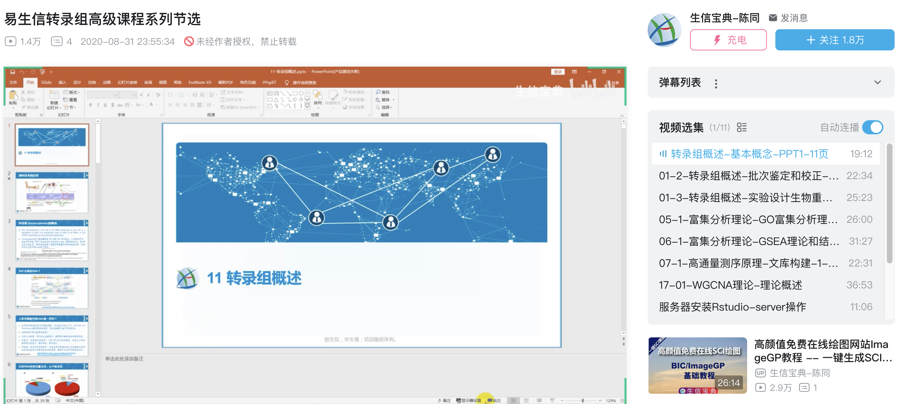

> 福利公告：为了响应学员的学习需求，经过易生信培训团队的讨论筹备，现决定安排扩增子16S分析、宏基因组、临床基因组、单菌基因组、转录组线上线下同步开始（线上采用腾讯会议同步直播线下）。报名*参加线上直播课的老师可在365天内选择参加同课程的一次线下课* 。期待和大家的线上线下相识。

* 转录组线上/线下开课时间：2025/03/21-22
* 临床基因组学线上/线下开课时间：2025/2/21-23
* 单菌基因组线上/线下开课时间：2025/1/10-12
* 宏基因组线上/线下开课时间：2025年5月9-11
* 扩增子线上/线下开课时间：2025/4/11-13

报名链接：http://www.ehbio.com/Training/

常规转录组是我们常接触到的一种高通量测序数据类型，其实验方法成熟，花费较低，是大部分CNS必备的技术，现在就如做个PCR一样常见。而且分析思路简洁清晰，是入门生信，学习生信分析思路和数据可视化的首选。

数据分析是相通的，通过一个简单的课程理解其中的原理，就可以推而广之，延伸到其它类型的数据分析，如扩增子、宏基因组、单细胞等。

*高级转录组分析和R数据可视化***线上线下**同步开课，将系统讲述基于和不基于比对的转录组分析流程，从原始数据到表达矩阵、差异基因、转录组拼装、可变剪接、非编码RNA、ceRNA、转录因子调控网络、富集分析、加权共表达网络、通路分析、可视化绘图、机器学习等一系列常见操作，理论和实践兼备，为大家提供一条走进生信大门的捷径、为同行提供一个转录组分析学习和交流的机会、助力学员真正理解分析原理和完成实战分析，独创四段式教学(2天集中授课+自行练习+讨论群讲解答疑+上课视频回看反复练习)，“教—练—答—用”四个环节统一协调，真正实现独立分析大数据。 

关于学习生物信息学分析的重要性，请阅读[《生物信息9天速成班—成为团队中不可或缺的人》](http://mp.weixin.qq.com/s/1nf7vwyvC3oemkTq_pu87A)。生信分析离不开程序写作，这部分没想象的难，只要跟着我们操作下来，就可以理解，具体见《[生物信息中的程序学习心得](https://mp.weixin.qq.com/s/xoLBg0pI9seEksa0hMXi0A)》。 

## 往期课程节选。 

部分视频可在B站空间免费查看：https://www.bilibili.com/video/BV1rD4y1272a

## 课程大纲 

**请详细阅读课程简介，如果以下内容您全精通，不必参加此培训。** 

每节课1小时一个主题，理论结合实战，学懂原理，实战实操，全是老司机多年经验、流程和代码的无私分享，手把手带您快速入门、节约宝贵的时间，助力科研成果早日产出。 

下面是课程安排，本课程一共2天，每天6-8节课，共14节课，全部课程均理论与实战结合(只要课上讲的都是可以学会并自己实现的分析)。如11代表第一天第一节课，26代表第二天第六节课。更有多节视频课处理特定问题和后续的讨论群永久答疑。

该课程为第23期，经过22次迭代更新，整个过程都比较成熟，可以在短时间学习更多知识。2-3天时间，老司机带您完成自学需要3个月甚至是1年的崎岖之路，助力您真正玩转转录组分析，并根据自己课题的背景优化分析方案。 

编号 | 内容 | 简介 
--- | ------ | -------------- 
01 | 视频学习Linux基础 | 预付后提供学习视频，生信宝典视频号有全套免费 Linux 课程 
02 | 视频学习R基础 | 预付后提供学习视频，生信宝典视频号有全套免费 R 课程 
03 | 软件安装 | 预付后提供安装视频 
04 | 支付全款 | 提供全部视频和资料用作预习 
11 | 转录组概述 | [转录组设计](https://mp.weixin.qq.com/s/qDy5kpM9Y_wBrk7QXZMFvA)、应用、[批次效应](https://mp.weixin.qq.com/s/mzcc1uIK6qDNZ4nZN0g4xQ)等 
12 | 转录组分析流程简介 | 基于/不基于比对的分析流程讲演 
13 | Salmon定量实战 | [不基于比对直接定量基因和转录本的表达](https://mp.weixin.qq.com/s/cEbOR6WAusTr1EK0a65chw) 
14 | 差异基因分析 | [DESeq2多组差异基因分析](https://mp.weixin.qq.com/s/Vmhx_TGxNkQzkekf93Xl4w)、热图、[火山图](https://mp.weixin.qq.com/s/i7uNJl5UeYcCZL3WPlxGLA) 
15 | GO富集分析和可视化 | [泡泡图](https://mp.weixin.qq.com/s/i7GOr5UMRp6OYTO40lgR8g)、热图、网络图、[弦图](http://mp.weixin.qq.com/s/6L8wmsy0eOxtiAEs3hYgCA) 
16 | GSEA富集分析和可视化 | [分组和时间序列GSEA](https://mp.weixin.qq.com/s/5ZEuII6ccJZZFdCsj6f3kA) 
17 | WGCNA基因加权共表达 | [网络分析和性状关联](https://mp.weixin.qq.com/s/8tEn9YYp0ciiuc8igFN8mw) 
18 | Linux下转录组环境配置 | [Conda软件安装、配置](https://mp.weixin.qq.com/s/tKAU09_w7Cu7khA9M2EGEQ) 
21 | 原始数据比对回基因组 | [STAR比对和定量](https://mp.weixin.qq.com/s/5B1GuPeRtRlYdke7CGtETg) 
22 | 基于count的差异基因 | [批次效应鉴定和移除](https://mp.weixin.qq.com/s/CDI-EFMuHfbr7P1JxsPwUA) 
23 | 基因组浏览器数据可视化 | [IGV呈现reeads比对、峰图、Sashimiplot](http://mp.weixin.qq.com/s/vWQUNgVujCTdZgZZ2_AZfQ) 
24 | 文章常见图表绘制和解读 | [Illustrator制作CNS标准图版](https://mp.weixin.qq.com/s/IJNyhinakY0lSXgCN7b9ug) 
25-26 | 机器学习和Marker基因鉴定 | [PCA](https://mp.weixin.qq.com/s/hDj8_72dBHGRhjZfD9H6Ww)，[随机森林](https://mp.weixin.qq.com/mp/appmsgalbum?action=getalbum&__biz=MzI5MTcwNjA4NQ==&scene=2&album_id=1688898593245462537&count=3&uin=&key=&devicetype=Windows+10+x64&version=63030522&lang=zh_CN&ascene=0&fontgear=2) 
31 | 转录本拼装StringTie | 可变剪接分析rMATS [视频课程]
32 | 非编码lncRNA鉴定 | ceRNA分析 (miRNA-lncRNA-gene调控) [视频课程]
33 | 无参转录组分析 | Trinity组装 eggnog注释 [视频课程]
34 | 二代三代测序原理介绍 | [建库测序过程及注意事项](https://mp.weixin.qq.com/s/SS9YBSpgUoU9gI86u-0ATg) [视频课程]
41 | 答疑-线上 | 答疑、考试内容串讲 

**教程内容简介如下：** 

### 转录组分析平台搭建

服务器平台：没有软件的计算机只是一堆废铁，没有转录组分析系统的服务器也和你的数据分析没有半毛钱关系。想要搭建整套的转录组分析流程，网上的资源即零散、又稀少。易生信团队将分享多年经验摸索优秀软件和布置技巧，并**分享全部源代码**，让你在主流Linux服务器系统(Ubuntu 16/18.04，CentOS7等主流发行版)上快速布置专注组分析流程依赖的几十款常用软件、几百个依赖的R和Python包，轻松拥有专业分析平台。转录组分析计算需求不大，目前一台办公笔记本或工作站就可以满足要求。

个人计算机平台：高通量测序所谓的大数据，都是在原始数据和分析过程中体量大，计算资源需求多，但结果文件不大。通常转录组分析会获得样品基因表达表、新转录本和非编码基因，这些表格是下游分析、高级分析以及个性分析的起点，绝大部分工作在我们的笔记本上是可以搞定的，只是很多人并不知道如何入手。

其实你的个人电脑就是数据表(丰度矩阵)统计分析的利器。易生信团队独创实现了跨平台的分析流程，在大家的Windows笔记本上可以轻松实现转录组统计、可视化的绝大多数分析，课程带你轻松在自己的本本上搭建数据表统计分析与可视化平台，基于目前主流的Win10进行优化和测试，让笔记本秒变数据分析可视化平台。 

### 生信基础知识 

有了生信分析平台，如何灵活运用还是要学点独门绝学的。21世纪最重要的是人才，人才最好掌握三门语言，将让你人生立于不败之地，在任何团队中都是不可或缺的人才。这三门语言就是*中文、英文和计算机语言*。中文每天都在用在学，英文对于博士也至少接触了10年以上并能应用于阅读和写作文献，而编程语言大家大学阶段都学过Visual Basic、Visual Foxpro、或C语言，但能在工作中应用的绝对凤毛麟角。更何况这些语言在生命科学领域是非常低效的，不提倡学习。 生信中常用的三类语言是·Shell + R + Python/Perl·，前两门是基础，生物学家必要掌握的[Shell](https://mp.weixin.qq.com/s/rXjQfyEX2FnuW9HTM_Uc8Q)和[R语言](https://mp.weixin.qq.com/s/EZ8R4v4f_jU3aaUP-1p1MQ)基础知识，保证你完成项目分析。

我们在课上将同时讲解生物学家必要掌握的Shell和R语言基础知识，保证你高效、稳定的使用转录组分析平台、保证大数据分析和后期可视化至发表阶段所需的技能。我们在文后提供了学习视频供提前预习。

当你利用几个小时，走进大数据分析和可视化的大门后，你将发现一个全新的世界。很多人会感觉相见恨晚，爱上分析，从此走向人生的快车道。即使你对编程不感兴趣，这里面用到的理念也定能让你受益终身，在今后相关分析中事半功倍，比别人更胜一筹。再说现在连[小学生都学Python](https://mp.weixin.qq.com/s?__biz=MzI5MTcwNjA4NQ==&mid=2247484807&idx=1&sn=0a638f85a7dade1cce3c1759c30cb545&scene=21#wechat_redirect)了，再不会，孩子都带不好了。

(如果基础薄弱，报名付款成功后，可免费**领取[基础程序课](https://ke.qq.com/course/289264)**，做好准备工作, [让程序成为我们的得力工具而不是学习新知识的绊脚石](http://mp.weixin.qq.com/s/u8AmzvO0-PIS33ficKOrUQ)。) 

### 图表解读和绘制专题 

针对很多老师缺少系统的生信背景，看不懂分析文章图表，更对绘制各式图表手足无措的情况，在培训时，我们将结合发表的高水平文章，进一步讲解16种常用分析图的原理和使用范围，让你不仅读懂图，更知道如何应用于自己的研究，并亲自轻松完成绘图。

针对大家使用R语言绘图学习时间成本较高的问题，易生信团队针对常用16种图开发了[免费绘图网站](https://mp.weixin.qq.com/s/i8N4m0ii5d0DiHVGKAH0hg)，一键出图，更可鼠标点选参数修改图形的个性样式。

成果发表是科研过程中不可缺的一部分，发表成果又少不了图形展示。文章图表排版是否整齐规范、协调一致、重点突出对一篇文章的发表也是有不少贡献的。之前推出的[文章发表图的修改和排版](https://mp.weixin.qq.com/s/IJNyhinakY0lSXgCN7b9ug)讲演了部分图形编辑和排版操作，本次培训也会实践从原始图形、到细节修饰再到排版发表的整个过程和注意事项。

### 转录组高级分析

 

1. [WGCNA基因共表达分析,WGCNA基因、表型关联分析](https://mp.weixin.qq.com/s/PMb2xwADvnMwaipyFXdtzQ) 
2. Cytoscape绘制ceRNA、转录调控、蛋白蛋白互作网络 
3. [Cytoscape 共表达网络绘制](https://mp.weixin.qq.com/s/sKEy_Pn9qnWw4W-aXraA5g) 
4. [KEGG/Reactome通路图表达映射](https://mp.weixin.qq.com/s/jI6Gz1JKxnGB9jDRSFjd0g) 
5. [基因互作的文献挖掘和数据库挖掘](https://mp.weixin.qq.com/s/1LNae0pG0w_Q-rRxhI96Pg)展示 
6. GO/GSEA（普通分组、数量形状和时间序列）的定制分析

### 转录组的应用、设计和案例分享

转录组是很常规的分析，也是入门高通量测序分析的基础。这部分涵盖整个高通量测序技术的应用，高通量测序技术的实验原则包括测序通量、测序批次、测序原理等。 

 
1. 转录组学研究技术介绍 
2. 转录组学实验设计和测序原则、注意事项 
3. [二代](https://mp.weixin.qq.com/s/SS9YBSpgUoU9gI86u-0ATg)、三代测序过程和原理解析 
4. 转录组学文章案例分析 
5. 在线基因表达资源数据库 

### 转录组分析流程实战

 

1. [转录组分析流程评估](https://mp.weixin.qq.com/s/NUEi6oRFL7B3f1FpCD4Xug) 
2. [测序数据质量评估和清洗](https://mp.weixin.qq.com/s/tDMih7ISLJcL4F4sWBq3Vw) 
2. 不基于比对的[差异基因分析](https://mp.weixin.qq.com/s/Vmhx_TGxNkQzkekf93Xl4w) 
3. 基于比对的差异基因分析 
4. 转录本组装、选择性剪接分析和非编码RNA鉴定 
5. [目标基因GSEA/GO富集分析](https://mp.weixin.qq.com/s/d1KCETQZ88yaOLGwAtpWYg) 

### 学习完本课程，你能得到什么？ 

1. 深彻理解生物测序数据的基本思想和分析流程 
2. 高级转录组分析和可视化的全套流程 3，应用于各个领域的分析经验、代码和发表级别的结果可视化 

### 往期精彩回顾 

学员主要来自中国大陆各高校和研究所的院长、教授、副教授、研究所和本科生，也有来自茅台、五粮液、安琪酵母、华为等大厂的科研人员，甚至有海外华人不远万里从美国、欧洲、澳州、新西兰、新加坡等地飞来北京参加专题学习研讨会。 

 

 

 

### 主讲教师 

**陈同**，博士，中国中医科学院，2015毕业于中科院遗传发育所，生物信息博士，在***Cell Stem Cell(IF=23.2，第一作者兼封面文章)、Nature Communications、Nucleic Acids Research X 2、Protein & Cell***等高水平杂志以第一作者或主要作者发表文章，运营有数十万人关注的[《生信宝典》](https://mp.weixin.qq.com/s/2b3_8Vvv7McqCkEfUszW3A)微信公众号，给你不一样的学习生信体验。 

### 授课模式 

线上线下同步开课，线上采用腾讯会议直播。整个过程都会录屏，视频可无限期观看，供后续反复观看学习。

本课程以讲解流程和实际操作为主，采用独创四段式教学，封装好的代码全部分享，随处可用： 

- 第一阶段  2-3天集中授课； 
- 第二阶段 自行练习2周； 
- 第三阶段 在线直播答疑； 
- 第四阶段 培训视频继续学习； 
- 实现教-练-答-用四个环节的统一协调。 

### 培训时间 

每天早9点到晚6点，半封闭式教学 (最后1小时为集中讨论时间，最后一天会稍微提前一些，多留出时间讨论，也方便老师乘车返回) 

报到时间：课程当天 

### 授课地点 

线下北京市。

线上线下同步开课，线上采用腾讯会议直播。整个过程都会录屏，视频可无限期观看，供后续反复观看学习。 

### 课程价格 

1. 开课两周前报名 4500 元/人 
2. 名额有限，报名速速 

### 课程福利 

1. 连报优惠——连报n门课，每个课程便宜n-1百元； 连报课程的优惠不出现在第一门，而是已累计的形式出现在后面几门中，也就是第一门完成了第二门才有优惠。 
2. 老学员优惠： 第二门课程减100，第三门课程减200，后面类比，最多不超过500元。 3
. 多人组团优惠，优惠幅度为参团人数-1百元 （报名时付款时有团员退出的，优惠按实际参团人数计算）。 
4. 优惠后最终价格最低不低于4000元。

优惠信息处于动态变化中，价格以系统最终计算出的正确价格为准。 

**注意事项** 

1. 需自备笔记本电脑，推荐使用win10系统，4G以上内存(推荐8G)。 
2. 培训班所有数据，文档为内部资料，仅供参阅，未经允许不得翻印外传登刊 
3. 上课期间禁止录音，录像 
4. 成功付款的学员，若临时有紧急事情不能到来的，可申请延期，更换后续培训班；也可申请退款 
5. 若开课2周 (含) 前申请退款可退还85%费用；开课3个工作日 (含) 前申请退款退还70%的费用 (若已开发票需承担相应手续费) 
6. 不可先延期再退款 